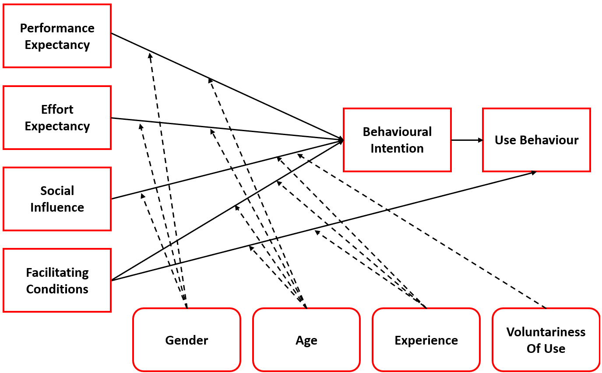
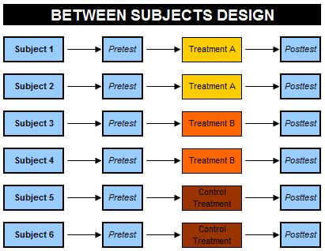
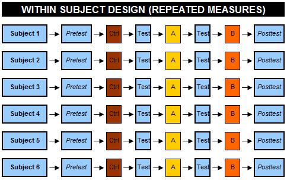
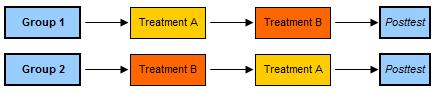
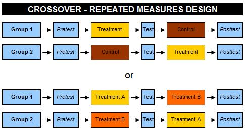

```{r setup, include=FALSE}
library(tidyverse)
library(datasets)
library(kableExtra)
```

```{r child="header.Rmd"}
```


# Wissenschaftstheorie, Theorie und Empirie

## Allgemeine Wissenschaftstheorie 
Teilgebiet der Philosophie (engl. philosophy of science)
- Welche Möglichkeiten und Grenzen hat der menschliche Erkenntnisprozess?
- Gesellschaftliche Funktion von Wissenschaft


---
# Fachspezifische Wissenschaftstheorie 
Fachspezifisch z.B. für Informatik (engl. philosophy of computer science)

## Ontologie (Was ist Gegenstand?)
  - Vorannahmen über den Untersuchungsgegenstand
  - z.B. Realismus vs. Idealismus
  - z.B. Kausalitätsprinzip vs. Chaos
  
## Epistemologie (Erkenntnistheorie)
  - Was ist Theorie?
  - Was ist wahr?
  - Methodologie

## Axiologie (Werttheorie)
  - Werte und Wissenschaftsethik
  - Was ist gut?

---
# Exkurs Ethik der Informatik
Beispiel: ACM Code of Ethics (https://www.acm.org/code-of-ethics)
- Ethical Principals
  - Contribute to society and to human well-being, acknowledging that all people are stakeholders in computing.
  - Avoid harm.
  - Be honest and trustworthy.
  - Be fair and take action not to discriminate.
  - Respect the work required to produce new ideas, inventions, creative works, and computing artifacts.
  - Respect privacy.
  - Honor confidentiality.
- Professional Principals
  - Strive to achieve high quality in both the processes and products of professional work.
  - Maintain high standards of professional competence, conduct, and ethical practice.
  - Know and respect existing rules pertaining to professional work.
  - Accept and provide appropriate professional review.
  - etc.
---
#Grundlagen empirischer Nutzerforschung 
## Erkenntniszusammenhang 
## Begründungszusammenhang 
## Verwertungszusammenhang


---
#Erkenntniszusammenhang

##Anlass, der zu dem Forschungsprozess führt 
Ideen, Gespräche, Exploration, die das Problem strukturieren

Drei Arten:
- Ein empirisches Problem (es gibt noch keine Antwort)
- Ein theoretisches Problem (es gibt empirische Antworten, die aber zu unterschiedlichen Ergebnissen kommen)
- Ein Auftrag Dritter

---

# Begründungszusammenhang
All jene Schritte, mit deren Hilfe das Problem untersucht werden soll
- Welche Untersuchungen liegen bereits vor? 
- Welche Theorien sind _einschlägig_, die heranziehbar sind?
- Welche Teile des Problems werden untersucht?
- Welche Hypothesen sind aufzustellen?
- Welche Untersuchungsform und Methode soll angewandt werden?
- Was soll „gemessen“ werden, was soll variiert werden?
- Wer soll untersucht werden?
- Wie soll ausgewertet werden?


---

# Verwertungszusammenhang
- Welche Effekte haben die Ergebnisse auf soziale Strukturen? (Gruppen, Gesellschaften etc.)
- Wie allgemeingültig sind die Befunde?
- Form der Darstellung (Zielgruppe)
- Die Berichtspflicht (Publikation): Die Sichtbarmachung des wissenschaftlichen Fortschritts


---
# Erkenntnis-, Begründungs- und Verwertungszusammenhang
- bilden zusammen den forschungslogischen Begründungsrahmen bei empirisch-experimentellen Verfahren.
- Wann immer der theoretische Teil der Untersuchung unklar ist, kann das Konzept und das Ergebnis nicht eindeutig sein.
- Die saubere und kontrollierbare Konzeptualisierung einer Studie ist ein „Must“ 
  - sie steuert alle Entscheidungen über Methode, Stichprobe, Auswertung und bedingt die Verwertung der Ergebnisse.
  
  
  
---
# Das Leib-Seele Problem
##Zwei Extrema:
1. Alles ist Materie:

  - Menschliches Verhalten und Erleben ist also in seiner Gänze zurückführbar auf Gehirnzustände und Gehirnprozesse.

2. Alles ist Seele oder Geist:

  - Was wir wahrnehmen und mental verarbeiten ist nicht die letzte Wirklichkeit. Wir schaffen uns die Welt in unserer Vorstellung.
  
  
---
# Das Leib-Seele Problem
Entweder Materie und Geist interagieren, oder mentale und physische Zustände existieren parallel – koordiniert oder unabhängig voneinander

Mögliche Herangehensweise:
  - Bezüge zwischen physiologischen Prozessen auf der einen Seite und Erleben und Verhalten auf der anderen herstellen
  
  
  
  
  
---
# Induktion vs. Deduktion
## Wie kann man Gesetzmäßigkeiten erkennen?
1. Situationen beobachten und dann mögliche Erklärungen finden => **induktiv**
  - Vom Teil auf das Ganze
  - Vom Experiment zur Theorie
  
2. Mögliche (vorläufige) Erklärung (Hypothese) im Kopf haben und dann prüfen => **deduktiv**
  - Vom Ganzen auf das Teil
  - Von der Theorie zum Experiment
  
## Wissenschaftliche Forschung braucht und benutzt beides!
  


---
# Positivismus (oder Empirismus)
- es gibt eine einheitliche, reale Welt, in der die Ereignisse, die für die Wissenschaft interessant sind, stattfinden.

--
- Individuum ist ein Teil dieser realen Welt, genauso wie Gedächtnisprozesse, Emotionen und Gedanken; alle diese Vorgänge haben überdauernde Eigenschaften

--
- Wissenschaft erzeugt experimentelle Situationen, in denen sich psychologische Prozesse offenbaren; dies ermöglicht, diese Prozesse zu modellieren

--
- die Welt ist ein Gefüge von messbaren Variablen, die miteinander in gesetzmäßiger Weise interagieren können

--
- Modelle (mathematische Formulierungen) sollen zeigen, wie die Variablen zusammenwirken, insbesondere Ursache-Wirkungs-Beziehung

--
- Forschung testet Hypothesen über die Zusammenwirkung von Variablen und erstellt Theorien, die nach und nach zu wissenschaftlichen Gesetzmäßigkeiten werden


---
# Wirklichkeit als Konstruktion

auch Konstruktivismus

## Annahmen
- es gibt keine unabhängig von uns existierende Welt
- jeder Mensch konstruiert sich seine eigene Welt
- Aufgabe der Wissenschaft ist es, diese Welt zu entdecken
- Forschung ist eher qualitativ ausgerichtet
- steht in starkem Widerspruch zu den Grundannahmen des Positivismus

---
# Kritischer Rationalismus

Gegenposition zum Positivismus (Karl Popper)
- Hypothesen lassen sich .red[nicht] durch *induktive* Beobachtung allein prüfen
  - Beispielhypothese: Es gibt nur weisse Schwäne.
- Theorie benötigt den Deduktionsschluß im Verstand (ratio)

> Vorläufige Bestätigung und kritische Prüfung!

--

## Falsifikationsprinzip

Ich kann durch Empirie nur **beweisen**, dass etwas nicht gilt.
- z.B. einen schwarzen Schwan sehen.

**Zwei mögliche Zustände einer Theorie**:
- vorläufig bestätigt oder widerlegt
---
class: inverse, center, middle
# .yellow[Woher kommen Theorien?]


---
class: center, middle
# Intuition
# Induktion
# Metaphern
# Grounded Theory

.gray[Beispiele]


---
# Woher kommen also Theorien?
## Intuition
- Spontanität
- hohes Maß an Vorarbeit erforderlich, z.B. intentsives Literaturstudium
- grundlegendes Verständnis erhöht die Chance, dass ein neuer Eindruck zu einer guten Idee führt

--

## Induktion
- von etwas Besonderem auf etwas Allgemeines, von Daten auf Theorien schließen
- je besser das Grundwissen fundiert ist, desto fundierter sind auch die abgeleitetenTheorien

---
# Woher kommen also Theorien?
## Metaphern
- Mechanismus oder Modell aus anderem – oft technischem – Bereich wird als Analogie für psychologische Prozesse genutzt
- Beispiel: Computer als Methapher in der kognitiven Psychologie (Speichermodule oder Programme als Analogien zu Arbeitsspeicher oder Gedächtnisvorgängen)


--
## Grounded Theory (Glaser und Strass, 2005/1967)
- Theorien sollten immer auf Daten gegründet sein
- sukzessives Kodieren soll zu immer abstrakteren Kategorien führen, deren systematische Verbindung dann eine Theorie liefert


---
# Theorien der Psychologie (Bsp: Lerntheorie)

## Behaviorismus
Thorndike & Watson, Pawlow, Skinner, (1950er) 
- Gelerntes Verhalten ist Konsequenz aus Reiz-Reaktionslernen. 
- Ohne Verhalten kein Lernen. (Black-Box Prinzip)

--

## Kognitivismus
Tolman, Lewin, Bruner, Piaget (1950er)
- Gelerntes ist primär kognitiv. (White-Box Prinzip)
- Verhalten ist Konsequenz von kognitiven Prozessen und Umwelt.
- Umwelt ist objektiv und real.

--

## Konstruktivismus
Piaget (1980er)
- Lernen ist ein konstruktiver Prozess. Realität ist konstruiert.
- Verhalten ist Konseqeunz von kognitiven Prozessen als Reaktion auf innere Zustände.


---
# Auswahl an Theorien mit Bezug zur HCI


## CASA - Computers Are Social Actors
Nass, Steuer, Tauber (1994). 

Der Computer wird vom Menschen (irrtümlich) als sozial handelndes Wesen wahrgenommen. 

.pull-left[

]
.pull-right[

]

Eher Paradigma als Theorie.
---
# Auswahl an Theorien mit Bezug zur HCI

## Activity Theory
Lew Wygotski, Alexei Leontjew und Sergei Rubinstein (1920-1930).

Menschliche Handlungen sind systemische oder sozial eingebettete Phänomene.
- Aktivitäten als grundlegende Einheit der Analyse
- **Triade** aus Subjekt (Person), Objekt (Ziel) und Mediator (Werkzeug), in dynamischer Wechselwirkung
- **Hierarchische Struktur**: Aktivitäten in drei Ebenen: 
  - Aktivitäten, die durch Motive bestimmt sind, 
  - Handlungen, die durch Ziele geleitet sind, und 
  - Operationen, die durch Bedingungen und Mittel bestimmt werden.
- **Kontext und Entwicklung**: sozialer, kultureller und historischer Kontext und kontinuierliches Lernen  

### Gründe
- Mehr als nur behavioristisch oder psychoanalytisch.
- Sammelbegriff für ausgewählte Sozialwissenschaftliche Theorien
- Eher eine deskriptive Meta-Theorie oder Rahmenwerk

---
# Auswahl an Theorien mit Bezug zur HCI

## Self-Determination Theory
Deci und Ryan (1970)

Erklärt Aspekte von Motivation, persönlicher Entwicklung und Wohlbefinden.

- Drei Grundbedürfnisse
  - **Autonomie** - das Bedürfnis, eigene Entscheidungen zu treffen und ein Gefühl von Kontrolle zu haben, 
  - **Kompetenz** - das Bedürfnis, wirksam und fähig zu sein, und 
  - **soziale Eingebundenheit** - das Bedürfnis, Beziehungen zu anderen aufzubauen und sich als Teil einer Gemeinschaft zu fühlen.
  
- Kontinuum der Motivation
  - **amotiviertes Verhalten** - keine Motivation
  - **extrinsische** Motivation - Handeln aufgrund von äußeren Belohnungen oder Strafen (4 Stufen)
  - **intrinsische** Motivation - Handeln aus persönlichem Interesse und innerem Antrieb

---
# UTAUT
Unified Theory of Acceptance and Use of Technology (Venkatesh 2003) - Eher ein Modell



---
# Begriffsklärung

## Paradigma
Paradigmen sind breitere Rahmenwerke innerhalb einer Disziplin, die grundlegende Annahmen, Methoden und Werte teilen und definieren, was als legitime Forschung gilt.

## Theorie
Theorien bieten systematische Erklärungen und Vorhersagen für Phänomene und bilden die Basis für wissenschaftliche Forschung.

## Modell
Modelle sind vereinfachte (häufig mathematische) Darstellungen von Theorien oder Phänomenen, die dazu dienen, spezifische Aspekte besser zu verstehen und Vorhersagen zu treffen.


---
# Empirische Nutzerforschung
## Spezialprobleme der empirischen Nutzerforschung
- Haben viele Denkansätze Ansätze aus den Naturwissenschaften übernommen 
  - Beobachtbarkeit, 
  - Wiederholbarkeit, etc.
  
- Es gibt aber Besonderheiten im Gegenstand der Medieninformatik zu beachten, z.B.:
  - latente Variablen
  - Verhältnis zwischen Forscher und Gegenstand


---

# Latente Variablen

Die latente Variable ist ein Konstrukt oder Faktor.
  - Beispiele: Intelligenz, Gedächtnis, Emotionen, etc.

Keine tatsächliche Entität, nicht wirklich "greifbar"

Zwei  Formen der latenten Variable
- formative Messung: Wie man die latente Variable misst, bestimmt ihren Inhalt: z.B. “Intelligenz ist das, was der Intelligenztest misst”
- reflektive Messung: psychologische Tests und empirische Untersuchungsformen als Indikatoren für etwas “Dahinterliegendes”


---
class: inverse, center, middle

# Empirie


---
# Verhältnis Forscher – Gegenstand

## Früher (naive Vorstellung)
Forscher waren oft auch Probanden für ihre Forschung, z.B. zu Denk- und Gedächtnisprozessen

Prinzipielle Austauschbarkeit der Rollen von Forscher und Erforschten möglich

## Modern (kritischer Rationalismus)
Probanden werden zu Forschern und untersuchen den Versuchsleiter 
- “Was könnte der von mir wollen?”

Erwartungen auf beiden Seiten (Forscher und Proband) können Verhalten und Erleben stark beeinflussen
  
---
# Begriffsklärung

## Methode
**Ein** Verfahren für den wissenschaftlichen Erkenntnisgewinn.

## Methodik
Die Beschreibung der (mehreren) eingesetzten Verfahren im Zusammenhang einer Forschungsfrage. Beschreibung von "was man tut" oder "was man kann".

## Methodologie
Wissenschaftliche Auseinandersetzung mit Methoden und ihrem Einsatzgebiet, ihrer Grenzen und ihrer Auswahl. 

=> Metawissenschaft.  


---
# Übersicht über empirische Methoden

## Sammeln von Daten - Erhebungsmethoden
Hier quantitativ (z.B. Fragebogenstudie oder Experiment). Dazu gehört Wissen über:
  - Design of Experiments, Testtheorie, Stichprobenziehung, Survey-Methodik, Skalen, etc.
  
## Auswerten von Daten - Auswertungsmethoden
Deskriptive, explorative und Inferenzstatistik 
- Unterscheidung nach Methodenzweck
  - Beschreiben, Entdecken und Prüfen
- Strukturentdeckende Verfahren vs. strukturprüfende Verfahren

Viele (nicht alle) Verfahren können mit allen drei Zwecken eingesetzt werden.
- Beispiel: Korrelationsanalyse

---

class: inverse, center, middle
# Design of Experiments

---
# Experimente in der HCI

Typische Methode der Nutzerforschung mit dem Ziel der Isolation der Einflussgrößen

- Beobachtungen in der "Realität" (im Feld) werden von vielen Dingen beeinflusst
- Experimente reduzierten _störende_ Einflüsse
- Beispiel: Appnutzung Mobilität
  - Störung der Nutzung beim Wackeln im Bus

--

## Interne und Externe Validität
Experimente haben eine hohe interne Validität, Feldstudien eine hohe externe.

--

## Experiment-/Studien-Arten

- AB-Test - Zwei verscheidene Apps werden verglichen
- Participatory Design - User helfen bei der Gestaltung von Lösungen
- Diary Studies - Probanden führen ein Nutzungstagebuch
- Vignetten-Studie - Szenarien werden in einer einzelnen Variable variiert
- Fokus-Gruppen - Mehrere Personen diskutieren Anforderungen
- Contextual Inquiry - Forscher begleitet die Nutzung existierender Lösungen
- Case Studies - Fallstudien von besonderen Softwaresystemen 
- etc.

---

# Experimentelles Design

Für AB-Tests, Vignetten-Studien, Usability-Tests (o.Ä.) mit quantitativen Ergebnissen geeignet.

.pull-left[

## Between-subject Design
Zwei Gruppen, zwei “Bedingungen”, pro Person eine Bedingung


]

.pull-right[
## Within-subject Design
Eine Gruppe, zwei Bedingungen, pro Person zwei Bedingungen


]


---

# Gemischte Designs

## Counter-Balanced Design


## Cross-over Design

---
class: inverse, center, middle
## .yellow[ [Zurück zur Übersicht](index.html)]
