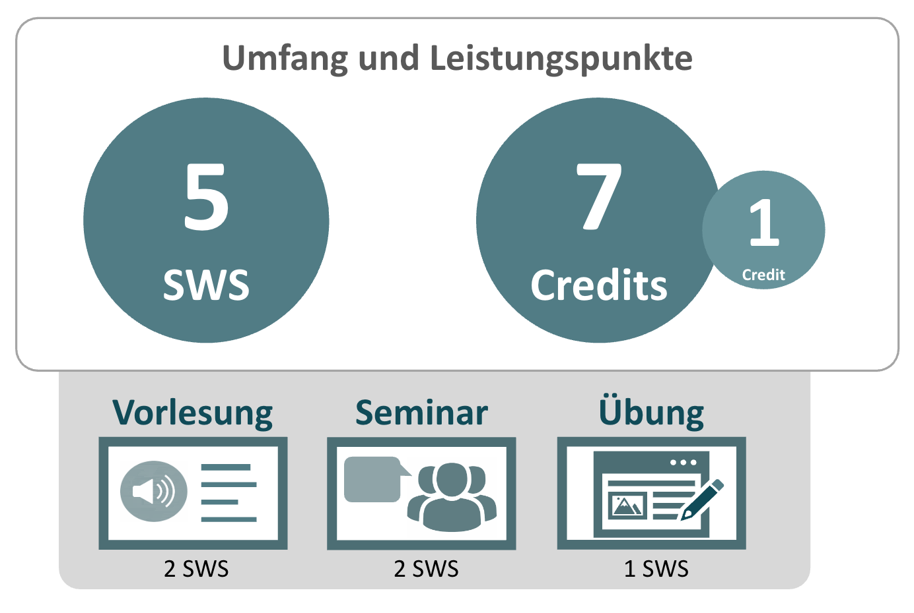
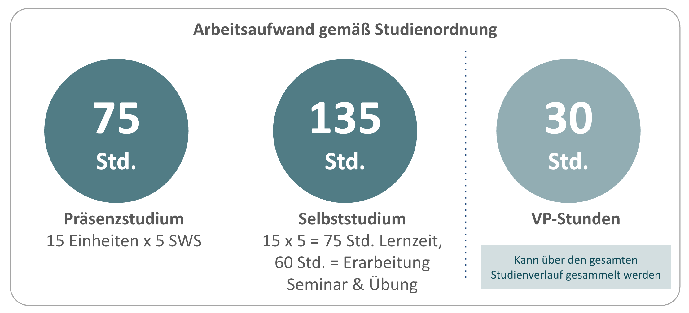
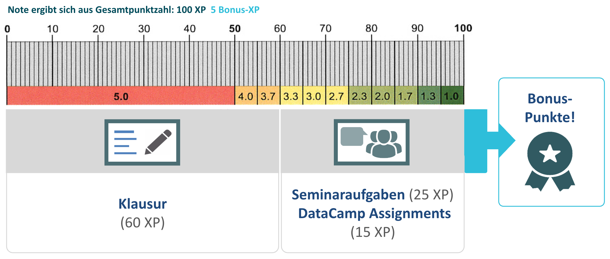
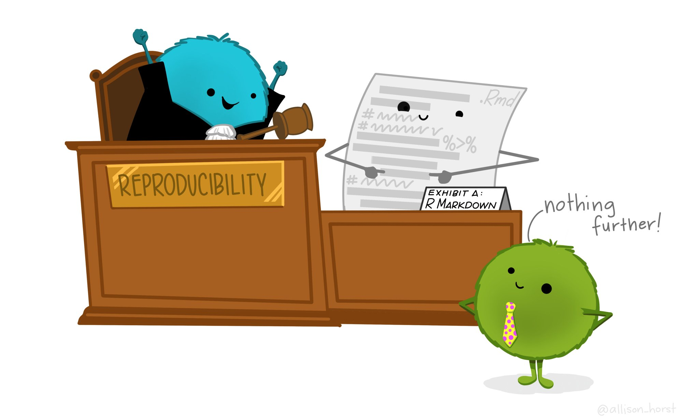
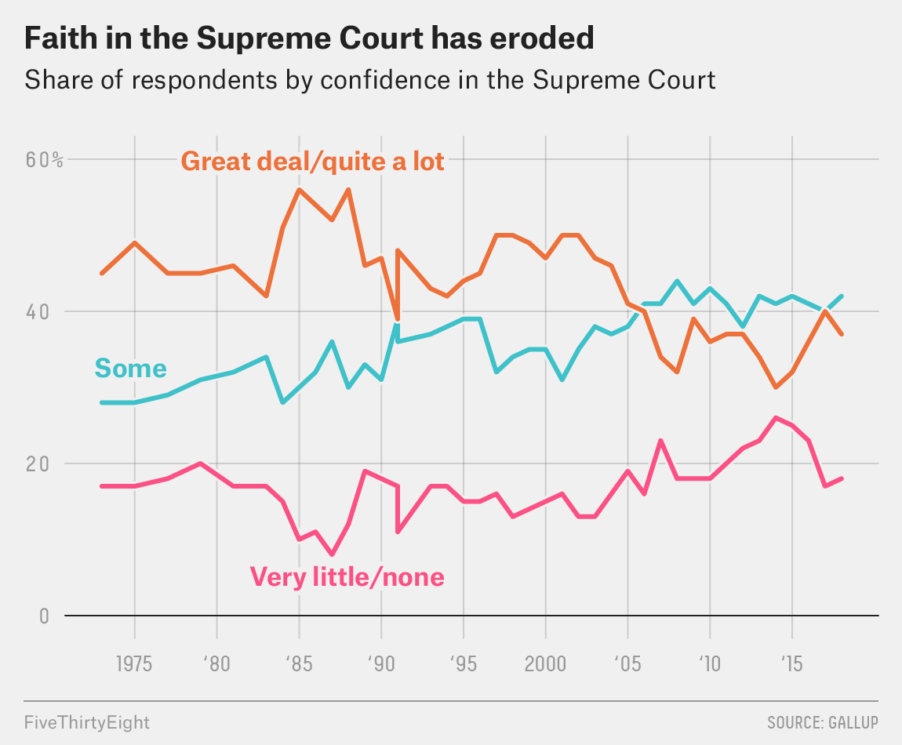
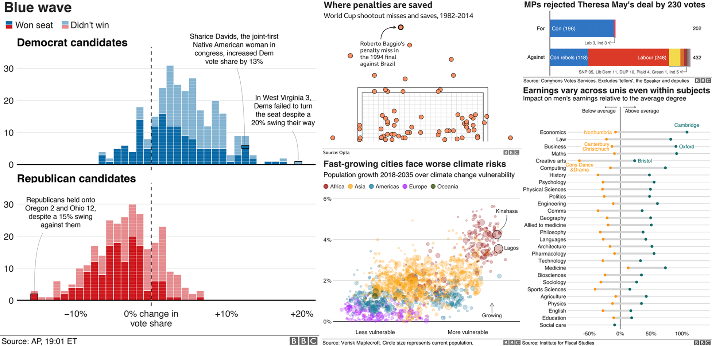
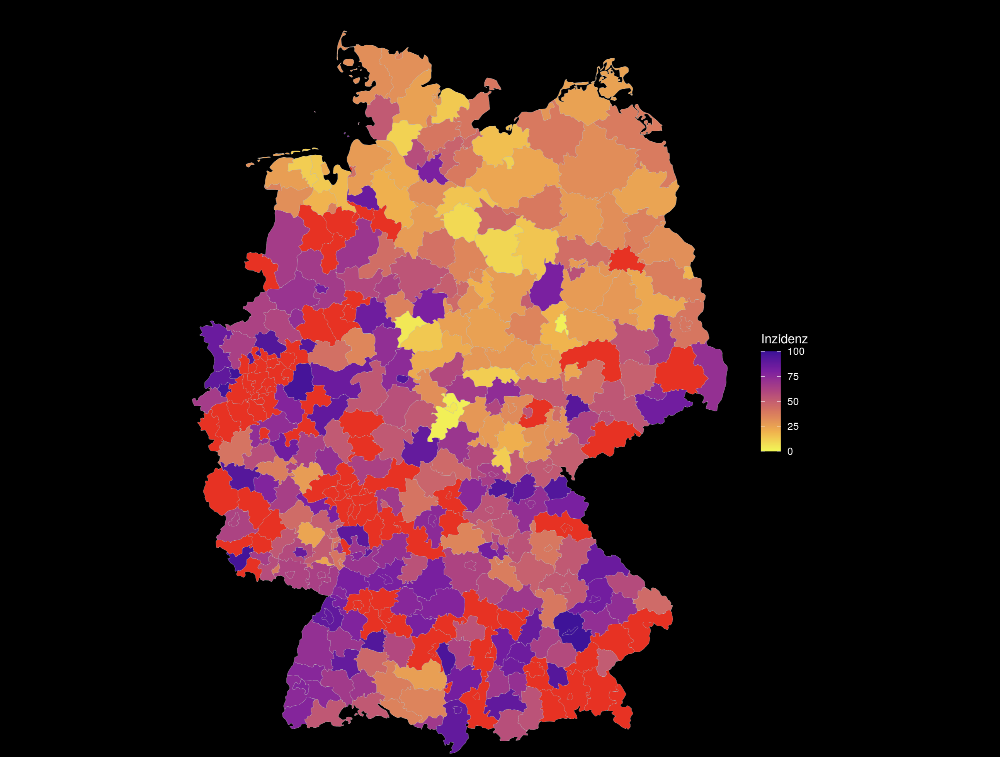
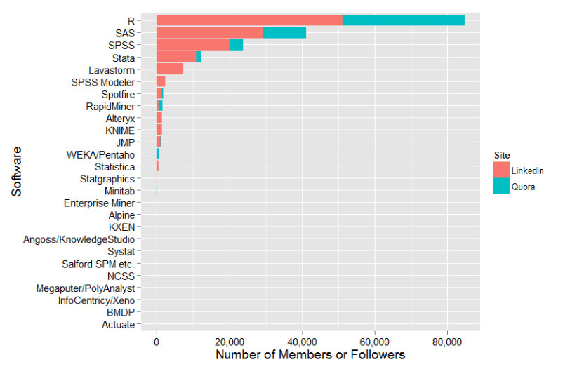
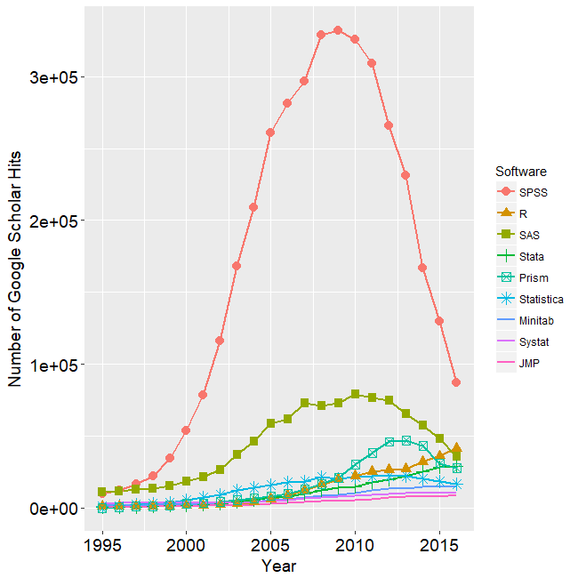
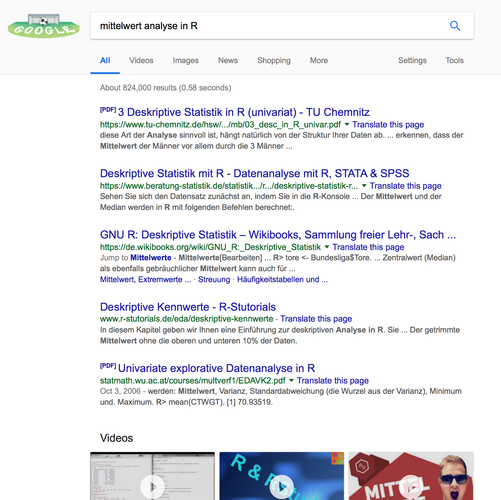

```{r setup, include=FALSE}
library(tidyverse)
library(datasets)
```

---

## Organisatorisches

### Umfang
* 5 SWS und 7 Credits (+1)

### Modus
* Vorlesung (2SWS) in Präsenz jede Woche
* Übung (1SWS) und Seminar (2SWS) alle 2 Wochen
* Off-Woche mit Online-Kurs (Datacamp) + Selbststudium

---

## Übersicht

```{r echo=FALSE, out.width="70%", dpi=600}

```

---

## Umfang

```{r echo=FALSE, out.width="100%", dpi=600}

```

---

## Note

```{r echo=FALSE, out.width="100%", dpi=600}

```

---

## Folien

https://t1p.de/smnf23

---

## Anmeldung und Klausur

### Anmeldung

- 2 Anmeldungen:
 - Anmeldung in Moodle
 - Anmeldung in DataCamp


### Klausur
- Termin 1: 02.08.2023
- Termin 2: 29.9.2023
- Die Klausur wird 50% Multiple-Choice- und 50% Freitext-Aufgaben sein.

---

## 2 Teile und 2 Ziele

### 1. Theorie und Mathematik


### 2. Praxis und R

---

## Vorlesung und Seminar


### Inhalt der Vorlesung
- Theorie und Grundlagen
- Einführung in die Praxis mit R

### Inhalt des Seminars
- Anwendung mit echter Forschungsfrage
- Übungen für den Umgang mit R


### **Beides** ist klausurrelevant.

---

# Warum R?

---

## Unterschied R und SPSS

### Datenanalyse mit GUI vs. Datenanalyse als Programmiersprache
* GUI<sup>1</sup> Datenanalyse-Tools: **SPSS**, STATA, RapidMiner, etc.
* Programmiersprachen für die Datenanalyse: Python, Julia, **R**, etc.

## SPSS
* Kostenpflichtig
* "Einfach" zu lernen
* Schnelle Analyse durch Menüführung
* Wiederholung von Analysen nur bei Anwendung von Syntax
* Schlechte Visualisierung

## R
* Kostenfrei
* Cross-Plattform kompatibel
* Höherer Lernaufwand
* Analyse erfordert das Schreiben eines Programms
* Wiederholung eingebaut
* Reproduzierbarkeit
* Druckreife Visualisierung, Gute Integration in Publishing Prozesse

*[1] Graphical User Interface. Programme mit Maussteuerung.*

---

## Vorteile von R im Detail (exemplarisch)

### Reproduzierbarkeit (Reproducibility)
* Im Sinne von Open-Science, nachvollziehbare Analysen
* Im Sinne der Arbeitserleichterung (z.B. neue, gleiche Studie)

```{r reproducibility, echo=FALSE, out.width="100%"}

```

---

## Einsatz im Berufsleben

```{r fivethirtyeight, echo=FALSE, out.width="100%"}

```

```{r orga/bbc, echo=FALSE, out.width="100%"}

```

```{r coronamapR, echo=FALSE, out.width="100%"}

```

*Quelle: http://fivethirtyeight.com, bbc.com*

---

## Ist R wichtiger auf dem Arbeitsmarkt?

Größere und aktivere Community
```{r linkedin_quora_2015, echo=FALSE, out.width="100%"}

```
***Abb. 1:** Anzahl LinkedIn Jobs und Quora Member 2015*

Gewinnt wissenschaftlich Bedeutung
```{r academicuse, echo=FALSE, out.width="100%"}

```
***Abb. 2:** Anzahl wissenschaftlicher Veröffentlichungen auf Google Scholar*

*Quelle: http://r4stats.com/articles/popularity/*

---

## Datenvisualisierung mit R

```{r datavis, echo=F, fig.width=6, fig.height=8}
ggplot(mtcars, aes(x = mpg, y = hp, color = factor(cyl))) +
  geom_point() + geom_smooth(method = "lm", formula = y ~ x) +
  labs(
    title = "Benzinverbrauch und Motorleistung",
    x = "Meilen pro Gallone",
    y = "PS",
    color = "Anzahl Zylinder",
    shape = "Gangschaltung"
  ) + theme_classic(base_size = 18) +
  theme(legend.position = "bottom")

```

Eine (langer) Befehl in R:
```{r datavisdemo, echo=T, eval=F, fig.width=6, fig.height=8}
ggplot(mtcars) +
  aes(x=mpg) +
  aes(y=hp) +
  aes(color=factor(cyl))) +
  geom_point() +
  geom_smooth(method="lm",
              formula=y~x) +
  labs(
    title="Benzinverbrauch und Motorleistung",
    x="Meilen pro Gallone",
    y="PS",
    color="Anzahl Zylinder",
    shape="Gangschaltung")
```

---

# Wie schaff ich das überhaupt?

---

## Lernmaterialien

### e-Learning der Universität zu Lübeck und Partner

- In Moodle werden sämtliche Inhalte zur Verfügung gestellt.
- DataCamp Übungsraum (online Trainingstool)
- Videoaufzeichnungen der Veranstaltungen + Tutorials
- Moodle Forum


### Literatur zur Veranstaltung

- Döring/Bortz - Forschungsmethoden und Evaluation

- Online-Bücher:
  - Computational Communication Sciene, Link: https://bookdown.org/andrecalerovaldez/ccs/
  - R for Data Science, Link: http://r4ds.had.co.nz
  - R for Social Science, Link: http://socviz.co/
  - Modern Dive: https://moderndive.com/index.html

---

## Zusätzliches Material

Es gibt hunderte Webseiten, Bücher, Foren zur R:
- http://compcogscisydney.org/learning-statistics-with-r/
- http://compcogscisydney.org/psyr/
- http://www.sthda.com/english/
- https://www.statmethods.net/index.html
- https://www.r-bloggers.com/
- Cheat-Sheets: https://www.rstudio.com/resources/cheatsheets/

### Twitter-Hashtags und User:

Twitter-Account anlegen und nach Hashtag suchen und Usern folgen.

Hashtags:
- \#rlang, #rstats, #r4ds, #rladies

User:
- @RLangTip, @RBloggers, @rOpenSci, @RLadiesGlobal, @hadleywickham, @juliasilge

---

## Was tun wenn etwas nicht funktioniert?

Google!
```{r googlesearch, echo=FALSE, out.width="100%"}

```
