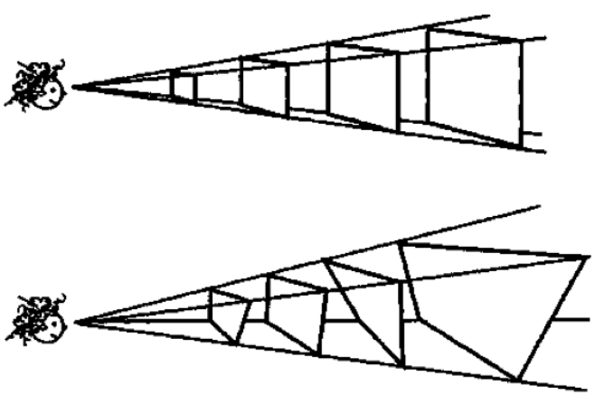
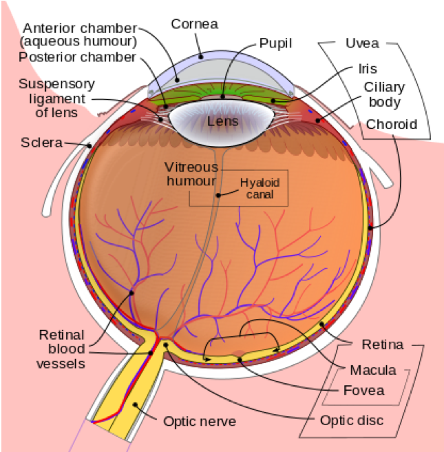
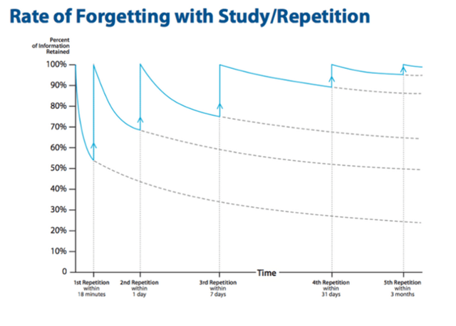

```{r setup, include=FALSE}
library(tidyverse)
library(datasets)
library(kableExtra)
```

```{r child="header.Rmd"}
```

---
# Wiederholung

## Prozess: Wissenschaftlichen Erkenntnisprozess

--

1. Theorie-geleitetes Vorgehen
1. Struktur des Prozesses
1. Sammeln von empirischen Daten
1. Aufbereiten von empirischen Daten
1. Analysieren von empirischen Daten
1. Dokumentation des Prozesses

--

## Gründe: Schwierigkeiten menschlicher Wahrnehmung
1. Kein "Sinn" für objektive Wahrheit
1. Menschliche Sinne dienen dem Überleben

--

## Ziel: Reduktion von Verzerrung, Objektivierung

---
class: inverse, middle, center

# .yellow[Gründe für Methoden]
Exkurs: visuelle Wahrnehmung

---
# Wahrnehmung ist "Computation"

--

.pull-left[
- Visuelle Informationen sind mehrdeutig
- für jedes 2-Dimensionale-Abbild gibt es unendliche viele mögliche Urbilder
- Bidirektionaler Prozess
  - Bottom-Up (Sensorik zum Perzept)
  - Top-Down (Perzept zur Sensorik)

- Berechnung und Steuerung von Wahrnehmung

]

.pull-right[
```{r pinker-vision, echo=FALSE, out.width="100%"}

```
.figurecaption[Aus (Pinker, 1999)]

]

.footnote[Pinker, S. (1999). How the mind works. *Annals of the New York Academy of Sciences*, 882(1), 119-127.]

---
# Ames Room Illusion

```{r roomillusion, echo=FALSE, out.width="100%"}
knitr::include_graphics("figs/qualiquanti/roomillusion.gif")
```


---
# Grenzen der visuellen Wahrnehmung
.pull-left[

Die Fovea:
- kleiner Bereich mit hoher Zapfendichte
- Schärfster Bereich des Sehens
- 0.5  2° des Sichtfeldes

Nur hier sieht man farbig und scharf

Blinder Fleck am Sehnerv
]

.pull-right[

.figurecaption[ Quelle: Wikipedia ]
]

---

background-image: url("figs/qualiquanti/fovea-example.png")
background-size: cover


---


.pull-left[
##Beispiel Top-Down Prozess


Quelle: [Wikipedia](https://de.wikipedia.org/wiki/Optische_T%C3%A4uschung)
]

.pull-right[
## Vergessen und Erinnern


Ebbinghaus untersuchte Erinnerung und Vergessenskurven

Interferenz:
- früher gelerntes wirkt sich auf später gelerntes aus.

]


---
# Biases und Verzerrungen

## Grenzen gelten für..
- sämtliche Sinne (Sehen, Hören, Fühlen, Riechen, Schmecken, Propriozeption, etc.)
- Aufmerksamkeit (geteilte Aufmerksamkeit, Attention inhibition, etc.)
- Erinnerung (Interferenz, Ebbinghaussche Listen, etc.)

## Warum gibt es überhaupt Grenzen?


---
class: center, middle
# 4 Gründe für Verzerrungen

--
## Zu viele Information

--
## Was soll erinnert werden?

--
## Nicht genügend Bedeutung

--
## Schnelles Handeln erforderlich


---


background-image: url("figs/qualiquanti/biases.png")
background-size: cover

[-Link-](https://en.wikipedia.org/wiki/List_of_cognitive_biases)
---
class: inverse, center, middle
>Ziel von Forschung ist es, allgemeingültige Aussagen und Theorien zu ermöglichen, die jenseits der subjektiven Meinung oder Erfahrung Einzelner Gültigkeit haben.

---
# Darum Methoden!

Auch Wissenschaftler sind nicht *gefeit* vor:
- falschem Alltagswissen
- Halbwahrheiten
- ungeprüftem Wissen
- überholtem Wissen

--

Fehler fallen nicht auf:
- Feste Überzeugung führt zur Erfüllung (self-fulfilling prophecy)
- Kognitive Dissonanz (selektive Erinnerung, preference-based information processing)

--

Trifft insbesondere Medieninformatik:
- schneller Technologiewandel
- viele verschiedene Kontexte
- falsche Übertragungen aus anderen Domänen
- unterschiedlichste Nutzergruppen


---
class: inverse, middle, center

# Empirische Daten und Prozesse

---

# Qualitative Methoden

1. .orange[**Sammeln**] von empirischen Daten
2. .orange[**Aufbereiten**] von empirischen Daten
3. .orange[**Analysieren**] von empirischen Daten
4. .orange[**Dokumentation**] des Prozesses

--
Beispiele:
- Tiefeninterview, leitfadengestützes Interview, Fokusgruppen
- Card-Sorting, Walkthrough, User-Test
- Audio- oder Video-Transkription
- Inhaltsanalyse, Medienanalyse, Diskursanalyse
- Grounded Theory, etc.

--

Fokussieren den nicht quantitativen Erkenntnisgewinn, sondern
- Gründe, Ursachen, Zusammenhänge
- Hypothesengenerierung
- Theorieentwicklung

---
class: inverse, center, middle
# .yellow[Qualitative Erhebungsmethoden]

---
# Fokusgruppe

Inhalt folgt.

---
# Interview

Inhalt folgt.

---
# Case Study

Inhalt folgt.

---
# Ethnographie

Inhalt folgt.

---
class: inverse, center, middle
# .yellow[Qualitative Auswertung]

---
# Transkription

Inhalt folgt.

---
# Mayring: Qualitative Inhaltsanalyse

Inhalt folgt.

---
# Gütekriterien qualitativer Forschung

Inhalt folgt.

---
class: inverse, center, middle
## .yellow[ [Zurück zur Übersicht](index.html)]
