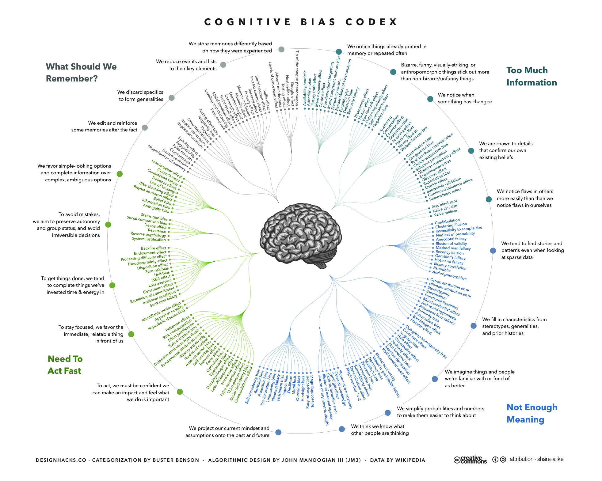

```{r setup, include=FALSE}
library(tidyverse)
library(datasets)
```

## Wiederholung

**Prozess: Wissenschaftlichen Erkenntnisprozess**

1. Theorie-geleitetes Vorgehen
1. Struktur des Prozesses
1. Sammeln von empirischen Daten
1. Aufbereiten von empirischen Daten
1. Analysieren von empirischen Daten
1. Dokumentation des Prozesses

**Gründe: Schwierigkeiten menschlicher Wahrnehmung**

1. Kein "Sinn" für objektive Wahrheit
1. Menschliche Sinne dienen dem Überleben

**Ziel: Reduktion von Verzerrung, Objektivierung**

# Gründe für Methoden — Exkurs: visuelle Wahrnehmung

---

## Wahrnehmung ist "Computation"

- Visuelle Informationen sind mehrdeutig
- für jedes 2-Dimensionale-Abbild gibt es unendliche viele mögliche Urbilder
- Bidirektionaler Prozess
  - Bottom-Up (Sensorik zum Perzept)
  - Top-Down (Perzept zur Sensorik)
- Berechnung und Steuerung von Wahrnehmung

```{r pinker-vision, echo=FALSE, out.width="50%"}
knitr::include_graphics("figs/qualiquanti/pinker-vision.png")
```

*Aus (Pinker, 1999)*

*Pinker, S. (1999). How the mind works. Annals of the New York Academy of Sciences, 882(1), 119-127.*

---

## Ames Room Illusion

```{r roomillusion, echo=FALSE, out.width="80%"}
knitr::include_graphics("figs/qualiquanti/roomillusion.gif")
```

---

## Grenzen der visuellen Wahrnehmung

Die Fovea:

- kleiner Bereich mit hoher Zapfendichte
- Schärfster Bereich des Sehens
- 0.5–2° des Sichtfeldes

Nur hier sieht man farbig und scharf.

Blinder Fleck am Sehnerv.


*Quelle: Wikipedia*

---

## Fovea-Beispiel


---

## Beispiel Top-Down Prozess & Vergessen/Erinnern

**Optische Täuschung (Kanizsa)**


**Vergessen und Erinnern**


Ebbinghaus untersuchte Erinnerung und Vergessenskurven.

Interferenz: früher gelerntes wirkt sich auf später gelerntes aus.

---

## Biases und Verzerrungen

**Grenzen gelten für..**

- sämtliche Sinne (Sehen, Hören, Fühlen, Riechen, Schmecken, Propriozeption, etc.)
- Aufmerksamkeit (geteilte Aufmerksamkeit, Attention inhibition, etc.)
- Erinnerung (Interferenz, Ebbinghaussche Listen, etc.)

**Warum gibt es überhaupt Grenzen?**

---

## 4 Gründe für Verzerrungen

1. Zu viele Informationen
2. Was soll erinnert werden?
3. Nicht genügend Bedeutung
4. Schnelles Handeln erforderlich

---

## Übersicht kognitiver Biases



<https://en.wikipedia.org/wiki/List_of_cognitive_biases>

---

## Ziel von Forschung

> Ziel von Forschung ist es, allgemeingültige Aussagen und Theorien zu ermöglichen, die jenseits der subjektiven Meinung oder Erfahrung Einzelner Gültigkeit haben.

---

## Darum Methoden!

Auch Wissenschaftler sind nicht *gefeit* vor:

- falschem Alltagswissen
- Halbwahrheiten
- ungeprüftem Wissen
- überholtem Wissen

Fehler fallen nicht auf:

- Feste Überzeugung führt zur Erfüllung (self-fulfilling prophecy)
- Kognitive Dissonanz (selektive Erinnerung, preference-based information processing)

Trifft insbesondere Medieninformatik:

- schneller Technologiewandel
- viele verschiedene Kontexte
- falsche Übertragungen aus anderen Domänen
- unterschiedlichste Nutzergruppen

# Empirische Daten und Prozesse

---

## Qualitative Methoden

1. **Sammeln** von empirischen Daten
2. **Aufbereiten** von empirischen Daten
3. **Analysieren** von empirischen Daten
4. **Dokumentation** des Prozesses

Beispiele:

- Tiefeninterview, leitfadengestütztes Interview, Fokusgruppen
- Card-Sorting, Walkthrough, User-Test
- Audio- oder Video-Transkription
- Inhaltsanalyse, Medienanalyse, Diskursanalyse
- Grounded Theory, etc.

Fokussieren den nicht quantitativen Erkenntnisgewinn, sondern:

- Gründe, Ursachen, Zusammenhänge
- Hypothesengenerierung
- Theorieentwicklung

# Qualitative Erhebungsmethoden

---

## Fokusgruppe

Inhalt folgt.

---

## Interview

Inhalt folgt.

---

## Case Study

Inhalt folgt.

---

## Ethnographie

Inhalt folgt.

# Qualitative Auswertung

---

## Transkription

Inhalt folgt.

---

## Mayring: Qualitative Inhaltsanalyse

Inhalt folgt.

---

## Gütekriterien qualitativer Forschung

Inhalt folgt.
