```{r setup, include=FALSE}
#library(plyr)
library(tidyverse)
library(datasets)
library(kableExtra)
library(purrr)
library(scales)
library(forecast)
library(EnvStats)
library(gghighlight)
library(jmv)
```

```{r child="header.Rmd"}
```

---
# Wiederholung
```{r distributions, echo=FALSE}

df <- data.frame(nums = 1:1000, dice_dist = (sample(1:6, 1000, replace = TRUE)), dist_norm = rnorm(1000), dist_pareto = rpareto(1000, 1, 4))
```
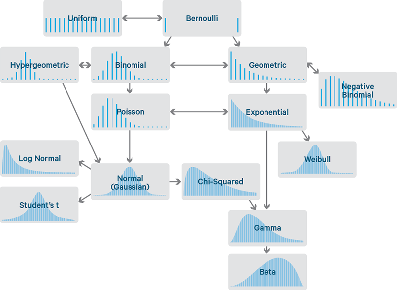


---
# Übersicht über Verteilungen
Unterschiedliche Verteilungen für unterschiedliche Arten von Zufall
.pull-left[
## Histogramm
```{r unif_dist, echo=FALSE, fig.height=5, fig.width=5, message=FALSE, warning=FALSE}
ggplot(df) + aes(x = dice_dist) +
  geom_histogram(stat = "count") +
  labs(x = "Augen", y = "Häufigkeit", title = "Gleichverteilung") +
  theme_minimal(base_size = 20) + scale_x_continuous(breaks = c(1:6))
```
]
.pull-right[
## Histogramm
```{r gaussian_distribution, echo=FALSE, fig.height=5, fig.width=5, message=FALSE, warning=FALSE}
ggplot(df) + aes(x = dist_norm) +
  geom_histogram() +
  labs(x = "X", y = "Häufigkeit", title = "Normalverteilung") +
  theme_minimal(base_size = 20) + scale_x_continuous(breaks = c(-4:4))
```
]

---
# Wiederholung Münzwurf
## Münzwurf oder Bernoulli-Verteilungen
- Konvention: *p* Probability.
$$p \in [0;1]$$
- *p = 0.5* bedeutet 50% Wahrscheinlichkeit, *p = 0.05* bedeute 5% Wahrscheinlichkeit

## Fairer Münzwurf (*p = 0.5*) - Binomial 9x
```{r binomial_distribution, echo=F, fig.width=8, fig.height=2.5}

unfair_coin <-
  tibble(prob = (dbinom(c(0:9), 9, 0.5)), result = paste0(0:9, "x"))

unfair_coin %>% ggplot() + aes(y = prob, x = result) + geom_col() + theme_minimal(base_size = 20) +
  labs(x = "Anzahl Kopf", y = "Wahrsch.") + ylim(c(0, 0.3))
```


---

# Deskriptive Statistik
Zentrale Tendenz - Mittelwert:
--
$$M=\frac{1}{n}\sum_{i=1}^nx_i$$

Dispersion - Varianz und Standardabweichung:
--

.pull-left[
$$\sigma ^{2}={\frac {1}{N}}\sum \limits _{i=1}^{N}(x_{i}-\mu )^{2}$$
]

.pull-right[
$$SD=+{\sqrt {{\frac {1}{n-1}}\sum \limits _{i=1}^{n}\left(x_{i}-{\overline {x}}\right)^{2}}}$$
]


--
Schiefe und Kurtosis

---
class: inverse, center, middle

#.yellow[Was ist Inferenz?]


---
# Inferenz

> Inferenz ist eine Schlußfolgerung mit Wahrheitsaussage.

Inferenz ist ein Teilgebiet der Logik, mit analogen Definitionen in der Linguistik, Informatik, Statistik.
- Ein logischer Schluß

--
Voraussetzung:
- Prämissen und Gesetze oder Hypothesen und Inferenzregeln

.pull-left[
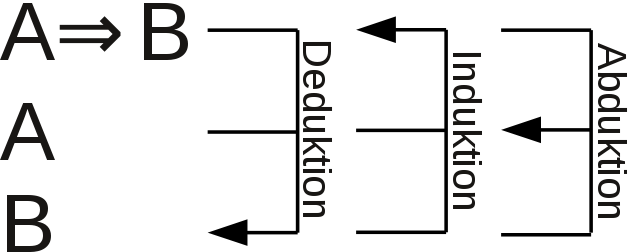
]


---
# Motivation
## Warum interessiert uns als Medieninformatiker Statistik?
- Warum machen wir das alles?
- Was ist unser Nutzen?
- Warum brauchen wir Statistik?

--

## Beschreibung der Welt trotz unvollständiger Daten

- Wir erheben immer nur Stichproben (entw. Personen oder Zeitpunkte)
- Wir sind an der Regel oder der Grundgesamtheit interessiert.
- Wir brauchen *Werkzeuge* um von der Stichprobe auf die Grundgesamtheit zu gelangen.

---
# Einfaches Beispiel
## Münzwurf: Fair oder unfair?

- Was ist Stichprobe, was ist Grundgesamtheit?

--

## Beispiel:
- Sie werfen eine Münze
- Es kommt abwechselnd: Kopf dann Zahl, Kopf, Zahl, ...

--


>Wie häufig muss man eine Münze werfen, bis man sich sicher ist, dass die Münze fair ist?

--

## Es gibt keine absolute Sicherheit bei Zufallsprozessen.

---
# Relative Sicherheit - Konfidenz
##Wir sind uns zu xx% sicher (konfident), dass ein Ereignis eintritt.

Wie viele Münzwürfe (Kopf + Zahl) brauchen wir, dass wir uns zu 95% sicher sind, dass die Münze fair ist?

--
## Fairness ist eine Punktschätzung (p = 0.5) und damit nicht lösbar.

---

# Konfidenzintervall

```{r konfidenzintervall-setup, echo=F, fig.height=6 , fig.width=10}
set.seed(0)
c.level <- 0.95

btest <- function(n, num = 1){
  res <- binom.test(c(n, n), p = 0.5, conf.level = c.level )
  res$conf.int[num]
}

n <- 20
df <- data.frame(count = 1:n, mean = 0.5, ci_lo =  map_dbl(1:n,  btest, 1), ci_hi =  map_dbl(1:n,  btest, 2))

ggplot(df) +
  aes(x= count, y=0.5, ymin = ci_lo, ymax = ci_hi) +
  geom_point() +
  geom_errorbar() +
  labs(title = paste0(c.level*100,"% Konfidenzintervall"),
       x="Anzahl Münzwürfe",
       y="Wahrscheinlichkeit für Kopf") +
  scale_y_continuous(labels = scales::percent_format(accuracy = 1)) +
  #scale_x_discrete(labels = waiver()) +
  NULL

```


---
# Bier und Alkohol
.pull-left[
Wir stellen uns vor: Wir proudzieren Guiness-Bier mit 4,1% Alkohol.
- Alkoholanteil unterliegt natürlichen Schwankungen und ist normalverteilt.
- Wir testen diese Behauptung.
- Wir kaufen 9 Guiness und messen einen Durschnittlichen Alkoholanteil von 3,9% mit einer Standardabweichung von 0,9%.

- Wie hoch ist die Wahrscheinlichkeit, dass die Angabe von 4,1% korrekt ist?

]
.pull-right[]

---
# Student's t-distribution
- Entwickelt von 1908 William Sealy Gosset (bei Guiness).

- t-Verteilung beschreibt die Wahrscheinlichkeit einer Abweichung von einem erwarteten Mittelwert für kleine Stichproben.
- t-Verteilung hat einen Parameter $\nu$ (gr. ny) oder *df * für degrees of freedom (*df = n-1*)

--

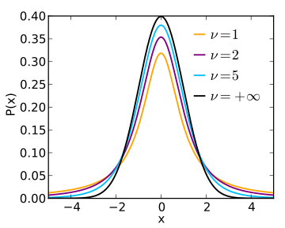 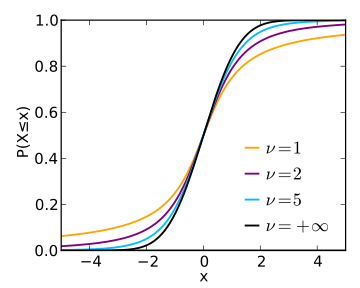

---
# Formel
Falls es Sie interessiert.
$$f(t) = \frac{\Gamma(\frac{\nu+1}{2})}{\sqrt{\nu\pi}\Gamma(\frac{\nu}{2})} (1+\frac{t^2}{\nu})^{-\frac{v+1}{2}} $$

--

mit
$$\Gamma(z) = \int_{0}^{\infty}e^t t^{z-1} dt $$

--

.center[]
---
# Berechnung des Unterschieds einer Stichprobe

$$ t = \frac{M - \mu}{{SD} / {\sqrt{n}}}$$
--
In unserem Beispiel also:

$$ t = \frac{3,9 - 4,1}{0,9 / \sqrt{9}} = \frac{-0,2}{0,3} = - 0,\bar{6}$$

--
```{r, echo=FALSE, fig.height=3}
tcdist <- data.frame(x = seq(-4, 4, 0.1), y=dt(seq(-4, 4, 0.1), df = 8))
tcdist %>% ggplot() + aes(x,y) + geom_line() +
  labs(title = "t-Verteilung für df=8", x="t", y="p") +
  geom_vline(aes(xintercept=-0.666667), color = "red") +
  geom_area(data = data.frame(x=seq(-4, -0.666667, 0.1), y=dt(seq(-4, -0.666667, 0.1), df=8)),  alpha = 0.5, fill = "red") +
  geom_area(data = data.frame(x=seq(-0.666667,4, 0.1), y=dt(seq(-0.666667, 4, 0.1), df=8)),  alpha = 0.5, fill = "green") +
  NULL

```
---
# Integrierte Verteilung
## Kumulative Dichte-Funktion


```{r tcd, echo=FALSE, fig.height=2.5}
tcdist %>% ggplot() + aes(x,y) + geom_line() +
  labs(title = "t-Verteilung für df=8", x="t", y="p") +
  geom_vline(aes(xintercept=-0.666667), color = "red") +
  geom_area(data = data.frame(x=seq(-4, -0.666667, 0.1), y=dt(seq(-4, -0.666667, 0.1), df=8)),  alpha = 0.5, fill = "red") +
  geom_area(data = data.frame(x=seq(-0.666667,4, 0.1), y=dt(seq(-0.666667, 4, 0.1), df=8)),  alpha = 0.5, fill = "green") +
  NULL


tdist <- data.frame(x = seq(-4, 4, 0.1), y=pt(seq(-4, 4, 0.1), df = 8))
tdist %>% ggplot() + aes(x,y) + geom_line() +
  labs(title = "Kumulative Dichtefunktion der t-Verteilung für df=8", x="t", y="p") +
  geom_vline(aes(xintercept=-0.666667), color = "red") +
  geom_area(data = data.frame(x=seq(-4, -0.666667, 0.1), y=pt(seq(-4, -0.666667, 0.1), df=8)),  alpha = 0.5, fill = "red") +
  geom_area(data = data.frame(x=seq(-0.666667,4, 0.1), y=pt(seq(-0.666667, 4, 0.1), df=8)),  alpha = 0.5, fill = "green") +
  geom_hline(aes(yintercept = 0.2618711)) +
  NULL
```
--
```{r}
pt(-0.666667, df=8)
```
---
# Interpretation

Die Wahrscheinlichkeit, dass wir eine 9er Stichprobe mit
- $M \le 3,9$% und
- $SD=0,9$% erhalten,

wenn die Produktion wirklich $\mu = 4,1$% Alkoholanteil beträgt,

ist 26,18% ( $p = 0.2618711$).

---
# Ausführung in R

- Hypothese: $\mu = 4,1$

```{r, echo=FALSE}
diver <- 1.034408
beer <- c(3.9, 3.1, 2.7, 4.8, 5.1, 3.8, 3.9, 3.9-diver, 3.9+diver)

```

Messwerte
```{r}
round(beer, 2)
t.test(beer, mu = 4.1, alternative = "less")
```


---
## Null-Hypothesen Signifikanz Test (NHST)
Jeder Test benötigt:
- Null-Hypothese $H_0$ - Wie die Welt ohne unsere Erkenntnis sein sollte.
- Alternativ-Hypothese $H_1$ - Der gefundene Wert in unserer Stichprobe.
- Freiheitsgrade (df) - Werden aus der Stichprobengröße berechnet.

Jeder Test liefert:
- eine Teststatistik, z.B. $t$
- einen Signifikanz-Wert, $p$

Wir legen fest:
- Signifikanz-Niveau $\alpha = 0.05$ - Schwelle, ab der wir die Null-Hypothese verwerfen.
  - unser p-Wert muss also kleiner sein als 0.05


---
# Fehler 1. Art und Fehler 2. Art
- $\alpha$-Fehler: Fehler 1. Art, wird über das Signifikanz-Niveau festgelegt.
- $\beta$-Fehler: Fehler 2. Art, wird über die Stichprobengröße festgelegt.

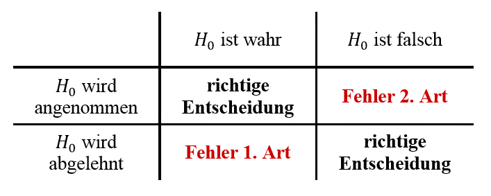

--
## Was ist schlimmer?


---

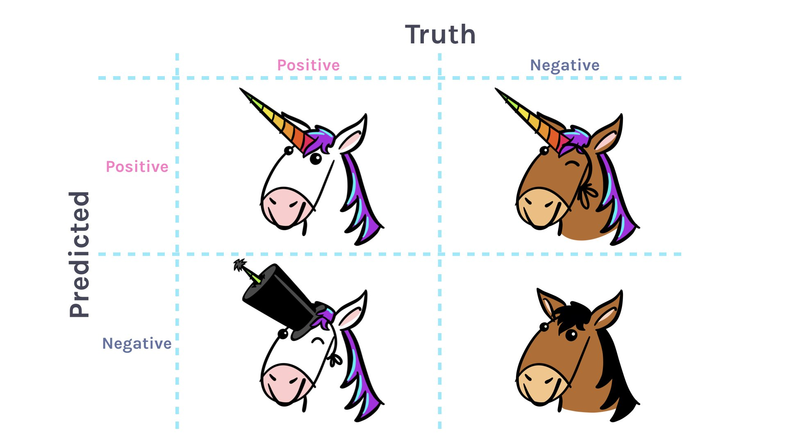

Credit: @apreshill
---
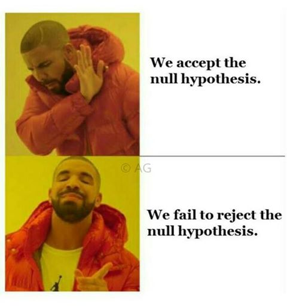

---

# Sozialwissenschaftlicher Kontext
Annahme: Zufallsstichprobe (z.B. Telefonnummer zufällig wählen)

**Frage:** Wenn wir in unserer Stichprobe eine Unterschied in der Körpergröße zwischen den Geschlechtern finden, wie sicher sind wir uns, dass der Unterschied auch in Grundgesamtheit existiert?
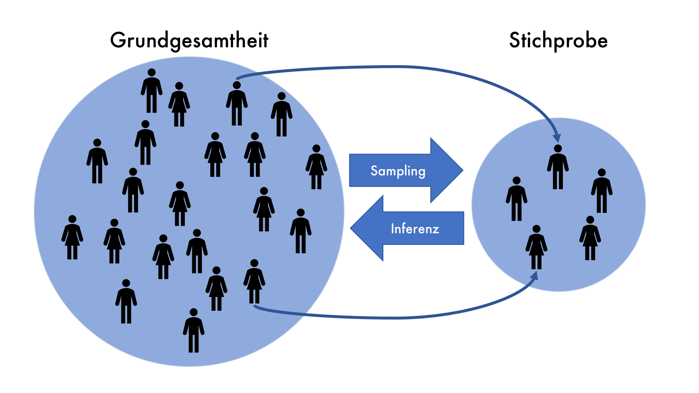


---
# Vorwärts durch das Problem
1. Annahme: Größe der Männer ist normalverteilt, $\mu = 180$ cm, $\sigma = 15$ cm

--

2. Annahme: Größe der Frauen ist normalverteilt, $\mu = 170$ cm, $\sigma = 15$ cm

--

## Simulation in R
```{r draw-samples}
men <- rnorm(n = 10, mean = 180, sd = 15)
women <- rnorm(n = 10, mean = 170, sd = 15)
```

--
Ergebnis:
```{r}
round(men)
round(women)
```

---
# Deskriptive Statistik
```{r}
round(men)
round(women)
```

--

Mittelwert unserer Stichproben
```{r}
mean(men)
mean(women)
```

---
# Wo liegt unsere beste Vermutung?

Männer haben eine durchschnittle Körpergröße von *M = 185cm (SD = 18)* und Frauen von *M = 165cm (SD = 10cm)*

--

>Wie wahrscheinlich ist es, dass es einen Unterschied in der Grundgesamtheit gibt?

--

68% der Männer sind zwischen 168cm und 203cm, 68% der Frauen zwischen 155cm und 175cm.

.pull-left[
```{r echo=FALSE, fig.height = 5}
library(ggpubr)
df <-data.frame(gender = c(rep(1,10), rep(2,10)), height = c(women, men))

df %>% filter(gender==1) %>% pull(height) %>% gghistogram(add.normal = T, add.rug = F) + labs(x="Körpergröße") + labs(x="Körpergröße", y="Anzahl", title="Frauen")
```
]
.pull-right[
```{r echo=FALSE, fig.height = 5}
df <-data.frame(gender = c(rep(1,10), rep(2,10)), height = c(women, men))

df %>% filter(gender==2) %>% pull(height) %>% gghistogram(add.normal = T, add.rug = F) + labs(x="Körpergröße", y="Anzahl", title="Männer")
```
]

---
# Versuch über einfachen t-Test
Vergleich Männer mit Durchschnittswert Frauen.
```{r}
t.test(men, mu=165)
```
--

Ist das korrekt?

--

Nein. Es fehlt ja die Streuung bei den Frauen.
---
# t-Test unverbundene Stichprobe


```{r}
t.test(women, men)
```

--

Die Wahrscheinlichkeit, dass wir ein solches Ergebnis bekommen, obwohl es keine Unterschied gibt liegt bei 0.6679%.

## Bericht:
Es gibt einen statistisch signifikanten Unterschied in der Körpergröße zwischen Männern und Frauen *(t(14.188) = -3.173, p = .006679)*. Dieser Unterschied liegt mit 95% Sicherheit zwischen 34.9cm und 6.8 cm

---
# t-Test unverbundene Stichprobe
```{r}
t.test(women, men)
```

Wie hoch ist die $\alpha$-Fehlerwahrscheinlichkeit?

- $\alpha$-Fehler = Signifikanz-Niveau! = 5%


---
# t-Test bei verbundener Stichprobe
Messwerte liegen innerhalb der Person
- z.B. vor und nach einer Schulung

```{r}
pre <- c(10,11,10,12,10)
post <- c(12,11,15,17,12)

t.test(pre, post, paired = TRUE)

```

- Streuung liegt innerhalb der Person
- kleinere Stichproben liefern bessere Ergebnisse

---


# Zusammenfassung

- Was ist Inferenz? Schließen von Stichprobe auf Grundgesamtheit.

- NHST Test-Verfahren zum prüfen einer Hypothese.
- Hypothesen ($H_0$ und $H_1$)
- Nur $H_0$ kann verworfen werden.
- Signifikanz-Niveau
- Test-Statistik und p-Wert prüfen.

- $\alpha$-Fehler und $\beta$-Fehler

3 Varianten t-Tests zum Prüfen von Unterschiedshypothesen
- einfacher t-Test, independent sample t-Test, paired sample t-Test

---
class: inverse, middle, center

# .yellow[Varianzanalyse]

---
# Wiederholung (ANOVA)
```{r anova_dist, echo=FALSE}
df <- data.frame(nums = 1:1000, dice_dist = (sample(1:6, 1000, replace = TRUE)), dist_norm = rnorm(1000), dist_pareto = rpareto(1000, 1, 4))
```

---

# T-Test und Inferenz

- Was ist Inferenz? Schließen von Stichprobe auf Grundgesamtheit.

- NHST Test-Verfahren zum prüfen einer Hypothese.
- Hypothesen ( $H_{0}$ und $H_1$ )
- Nur $H_0$ kann verworfen werden.
- Signifikanz-Niveau $\alpha$
- Test-Statistik (t) und p-Wert prüfen.

- $\alpha$-Fehler und $\beta$-Fehler

3 Varianten t-Tests zum Prüfen von Unterschiedshypothesen
- einfacher t-Test, independent sample t-Test, paired sample t-Test

---

# Einschränkungen des t-Tests

Grenzen:
- nur 2 Gruppen
- abhängige Variable muss normalverteilt sein

Der t-Test prüft eine Unterschiedshypothese.

## Mehrere Hypothesen
Was passiert wenn wir mehrere Hypothesentests hintereinander durchführen?

---
class: center
# Beispiel: Jellybeans
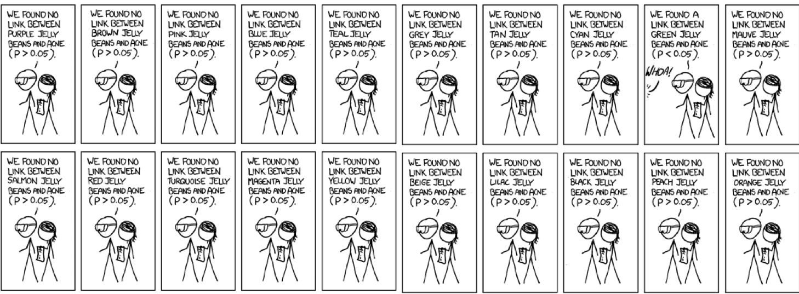

---
class: center
# Beispiel: Jellybeans


---
# Alpha-Fehler Kummulierung
Viele Hypothesen auf dem gleichen Datensatz zu testen erhöht den die Wahrscheinlichkeit einen alpha-Fehler zu begehen.

Wenn man 20 Hypothesen bei Signifikanz-Niveau $\alpha = 0.05$ testet, wie hoch ist die Wahrscheinlichkeit, dass man mind. eine "falsche" H1 Hypothese annimmt?


--
.pull-left[
```{r, echo=FALSE, fig.height=3, fig.width=5}

x <- 0:20
y <- dbinom(x, 20, 0.5)
df <- data.frame(x,y)
ggplot(df) + aes(x,y) + geom_col() + labs(title = "Binomial-Verteilung", subtitle = "20 Münzwürfe bei p = 0.5", x="k", y="p")

```
]


--
.pull-right[
```{r, echo=FALSE, fig.height=3, fig.width=5}

x <- 0:20
y <- dbinom(x, 20, 0.05)
df <- data.frame(x,y)
ggplot(df) + aes(x,y) + geom_col() + labs(title = "Binomial-Verteilung", subtitle = "20 Münzwürfe bei p = 0.05", x="k", y="p") + gghighlight(x>0)
sum(y[2:21])
```
]


---
# Unterschiedliche p-Werte, 20 Tests
```{r echo=FALSE}

library(plotly)

x <- 0:20
pval <- seq(0.01,0.99,0.01)
dat <- expand.grid(x = x, pval = pval) %>%
  mutate(y = dbinom(x, 20, pval)) %>%
  mutate(option = as.integer(as.factor(pval))) %>%
  mutate(label = scales::percent(y))

fig <- plot_ly(dat, type = "bar",
        x = ~x,
        y = ~y,
        frame = ~pval,
        text = ~label,
        hoverinfo = "text",
        showlegend = F
        )
fig <- fig %>%
  animation_opts(
    1000, easing = "elastic", redraw = FALSE
  )

fig <- fig %>%
  animation_button(
    x = 1, xanchor = "right", y = 0, yanchor = "bottom"
  )

fig
```


---
# Bonferroni Korrektur

Was kann man tun, um das zu verhindern?

--

.pull-left[
```{r, echo=FALSE, fig.height=3, fig.width=5}

x <- 0:20
y <- dbinom(x, 20, 0.05)
df <- data.frame(x,y)
ggplot(df) + aes(x,y) + geom_col() + labs(title = "Binomial-Verteilung", subtitle = "20 Münzwürfe bei p = 0.05", x="k", y="p") + ylim(0,0.4) + gghighlight(x>0)

sum(y[2:21])
```
]


--
.pull-right[
```{r, echo=FALSE, fig.height=3, fig.width=5}

x <- 0:20
y <- dbinom(x, 20, 0.05 / 20)
df <- data.frame(x,y)
ggplot(df) + aes(x,y) + geom_col() + labs(title = "Binomial-Verteilung", subtitle = "20 Münzwürfe bei p = 0.05 / 20", x="k", y="p") +
  #ylim(0,0.4) +
  coord_cartesian(ylim=c(0, 0.4)) +
  gghighlight(x>0)

sum(y[2:20])
```
]

Wenn man *k*-Hypothesen testen, korrigiert man $p/k$.


---
layout:true
# Beispiel
Whatsapp per Stunde nach Handytyp

---
```{r, echo=F, fig.height=6}
df_anova <- data.frame(value=c(1,2,3,4,5,6,7,8,9),
                       value2=c(4,5,3,6,7,5,8,5,7),
                       phone = factor(c(1,1,1,2,2,2,3,3,3), labels = c("Blackberry", "Android", "iPhone")),
                       user=paste("User", c(1:9)),
                       gender = factor(c(1,1,2,1,2,2,1,2,2), labels = c("male", "female")),
                       age = c(31,31,30,22,24,21,25,27,26))


ggplot(df_anova) + aes(x=phone, y= value, fill=phone) +
  labs(title="3 Gruppen je 3 Teilnehmer", x = "Gruppe", y="Wert", fill="Gruppe") +
  scale_y_continuous(breaks=1:9) +
  #geom_hline(yintercept = 5, linetype="dashed", size=1) +
  geom_point(stroke =1, size=3, shape=21) -> p
p

```

---
```{r, echo=F, fig.height=6}
p +
  geom_line(data = data.frame(x=c(0.8,3.2), y=c(5.0,5.0)), aes(x,y), inherit.aes = FALSE, linetype="dashed", linewidth=1) +
  geom_label(label="globaler Mittelwert", x=3, y=5.3, inherit.aes = FALSE) +
  NULL
```

$M = (1+2+3+4+5+6+7+8+9) / 9 = 45 / 9 = 5$

---
```{r, echo=F, warning=FALSE, fig.height=6}
p +
  gghighlight(value == 3, label_key = user, use_direct_label = F) +
  geom_line(data = data.frame(x=c(0.8,3.2), y=c(5.0,5.0)), aes(x,y), inherit.aes = FALSE, linetype="dashed", linewidth=1) +
  geom_line(data = data.frame(x=c(1,1), y=c(5.0,3)), aes(x,y), inherit.aes = FALSE, linewidth=0.5, color="red") +
  geom_label(label="M", x=3, y=5.3, inherit.aes = FALSE) +
  NULL

```

---
.pull-left[
```{r, echo=F, warning=FALSE, fig.height=6}
p +
  gghighlight(value == 3, label_key = user, label_params = list(size=8)) +
  geom_line(data = data.frame(x=c(0.8,3.2), y=c(5.0,5.0)), aes(x,y), inherit.aes = FALSE, linetype="dashed", linewidth=1) +
  geom_line(data = data.frame(x=c(1,1), y=c(5.0,3)), aes(x,y), inherit.aes = FALSE, linewidth=0.5, color="red") +
  geom_label(label="M", x=3, y=5.3, inherit.aes = FALSE, size=8) +
  theme_gray(base_size = 22) +
  NULL

```
]
.pull-right[
Residuum:

$2^2 = 4$
]

---
.pull-left[
```{r, echo=F, warning=FALSE, fig.height=6}
p +
  gghighlight(value == 2, label_key = user, label_params = list(size=8)) +
  geom_line(data = data.frame(x=c(0.8,3.2), y=c(5.0,5.0)), aes(x,y), inherit.aes = FALSE, linetype="dashed", linewidth=1) +
  geom_line(data = data.frame(x=c(1,1), y=c(5.0,2)), aes(x,y), inherit.aes = FALSE, linewidth=0.5, color="red") +
  geom_label(label="M", x=3, y=5.3, inherit.aes = FALSE, size=8) +
  theme_gray(base_size = 22) +
  NULL
```
]
.pull-right[
Residuum:

$2^2 + 3^2 = 4+9 = 13$
]

---
.pull-left[
```{r, echo=F, warning=FALSE, fig.height=6}
p +
  gghighlight(value == 1,
              label_key = user,
              label_params = list(size = 8)) +
  geom_line(
    data = data.frame(x = c(0.8, 3.2), y = c(5.0, 5.0)),
    aes(x, y),
    inherit.aes = FALSE,
    linetype = "dashed",
    linewidth = 1
  ) +
  geom_line(
    data = data.frame(x = c(1, 1), y = c(5.0, 1)),
    aes(x, y),
    inherit.aes = FALSE,
    linewidth = 0.5,
    color = "red"
  ) +
  geom_label(
    label = "M",
    x = 3,
    y = 5.3,
    inherit.aes = FALSE,
    size = 8
  ) +
  theme_gray(base_size = 22) +
  NULL
```
]
.pull-right[
Residuum:

$2^2 + 3^2 + 4^2 = 4 + 9 + 16  = 29 = R_1$
]

---
.pull-left[
```{r, echo=F, warning=FALSE, fig.height=6}
p +
  gghighlight(value == 4,
              label_key = user,
              label_params = list(size = 8)) +
  geom_line(
    data = data.frame(x = c(0.8, 3.2), y = c(5.0, 5.0)),
    aes(x, y),
    inherit.aes = FALSE,
    linetype = "dashed",
    linewidth = 1
  ) +
  geom_line(
    data = data.frame(x = c(2, 2), y = c(5.0, 4)),
    aes(x, y),
    inherit.aes = FALSE,
    linewidth = 0.5,
    color = "red"
  ) +
  geom_label(
    label = "M",
    x = 3,
    y = 5.3,
    inherit.aes = FALSE,
    size = 8
  ) +
  theme_gray(base_size = 22) +
  NULL
```
]
.pull-right[
Residuum:

$1^2 = 1$

$R_1 = 29$
]

---
.pull-left[
```{r, echo=F, warning=FALSE, fig.height=6}
p +
  gghighlight(value == 6,
              label_key = user,
              label_params = list(size = 8)) +
  geom_line(
    data = data.frame(x = c(0.8, 3.2), y = c(5.0, 5.0)),
    aes(x, y),
    inherit.aes = FALSE,
    linetype = "dashed",
    linewidth = 1
  ) +
  geom_line(
    data = data.frame(x = c(2, 2), y = c(5.0, 6)),
    aes(x, y),
    inherit.aes = FALSE,
    linewidth = 0.5,
    color = "red"
  ) +
  geom_label(
    label = "M",
    x = 3,
    y = 5.3,
    inherit.aes = FALSE,
    size = 8
  ) +
  theme_gray(base_size = 22) +
  NULL
```
]
.pull-right[
Residuum:

$1^2 + 0^2 + 1^2= 2 = R_2$

$R_1 = 29$
]

---
.pull-left[
```{r, echo=F, warning=FALSE, fig.height=6}
p +
  gghighlight(value == 7,
              label_key = user,
              label_params = list(size = 8)) +
  geom_line(
    data = data.frame(x = c(0.8, 3.2), y = c(5.0, 5.0)),
    aes(x, y),
    inherit.aes = FALSE,
    linetype = "dashed",
    linewidth = 1
  ) +
  geom_line(
    data = data.frame(x = c(3, 3), y = c(5.0, 7)),
    aes(x, y),
    inherit.aes = FALSE,
    linewidth = 0.5,
    color = "red"
  ) +
  geom_label(
    label = "M",
    x = 3,
    y = 5.3,
    inherit.aes = FALSE,
    size = 8
  ) +
  theme_gray(base_size = 22) +
  NULL
```
]
.pull-right[
Residuum:

$2^2 = 4$

$R_1 = 29$

$R_2 = 2$
]

---
.pull-left[
```{r, echo=F, warning=FALSE, fig.height=6}
p +
  gghighlight(value == 8,
              label_key = user,
              label_params = list(size = 8)) +
  geom_line(
    data = data.frame(x = c(0.8, 3.2), y = c(5.0, 5.0)),
    aes(x, y),
    inherit.aes = FALSE,
    linetype = "dashed",
    linewidth = 1
  ) +
  geom_line(
    data = data.frame(x = c(3, 3), y = c(5.0, 8)),
    aes(x, y),
    inherit.aes = FALSE,
    linewidth = 0.5,
    color = "red"
  ) +
  geom_label(
    label = "M",
    x = 3,
    y = 5.3,
    inherit.aes = FALSE,
    size = 8
  ) +
  theme_gray(base_size = 22) +
  NULL
```
]
.pull-right[
Residuum:

$2^2 + 3^2= 4 + 9 = 13$

$R_1 = 29$

$R_2 = 2$
]

---
.pull-left[
```{r, echo=F, warning=FALSE, fig.height=6}
p +
  gghighlight(value == 9,
              label_key = user,
              label_params = list(size = 8)) +
  geom_line(
    data = data.frame(x = c(0.8, 3.2), y = c(5.0, 5.0)),
    aes(x, y),
    inherit.aes = FALSE,
    linetype = "dashed",
    linewidth = 1
  ) +
  geom_line(
    data = data.frame(x = c(3, 3), y = c(5.0, 9)),
    aes(x, y),
    inherit.aes = FALSE,
    linewidth = 0.5,
    color = "red"
  ) +
  geom_label(
    label = "M",
    x = 3,
    y = 5.3,
    inherit.aes = FALSE,
    size = 8
  ) +
  theme_gray(base_size = 22) +
  NULL
```
]
.pull-right[
Residuum:

$2^2 + 3^2 +4^2= 4 + 9 + 16 = 29 = R_3$

$R_1 = 29$

$R_2 = 2$

]


---
.pull-left[
```{r, echo=F, warning=FALSE, fig.height=6}
p +
  gghighlight(value == 9,
              label_key = user,
              label_params = list(size = 8)) +
  geom_line(
    data = data.frame(x = c(0.8, 3.2), y = c(5.0, 5.0)),
    aes(x, y),
    inherit.aes = FALSE,
    linetype = "dashed",
    linewidth = 1
  ) +
  geom_line(
    data = data.frame(x = c(3, 3), y = c(5.0, 9)),
    aes(x, y),
    inherit.aes = FALSE,
    linewidth = 0.5,
    color = "red"
  ) +
  geom_label(
    label = "M",
    x = 3,
    y = 5.3,
    inherit.aes = FALSE,
    size = 8
  ) +
  theme_gray(base_size = 22) +
  NULL
```
]
.pull-right[
Residuum:

$R_1 = 29$

$R_2 = 2$

$R_3 = 29$

$SS_T = R_1 + R_2 + R_3 = 60$
]


---
```{r, echo=F, warning=FALSE}
p +
  geom_line(
    data = data.frame(x = c(0.6, 1.4), y = c(2.0, 2.0)),
    aes(x, y),
    inherit.aes = FALSE,
    linewidth = 1,
    color = 2
  ) +
  geom_label(
    label = "M1",
    x = 1.3,
    y = 2.3,
    inherit.aes = FALSE,
    size = 6
  ) +
  geom_line(
    data = data.frame(x = c(1.6, 2.4), y = c(5.0, 5.0)),
    aes(x, y),
    inherit.aes = FALSE,
    linewidth = 1,
    color = 3
  ) +
  geom_label(
    label = "M2",
    x = 2.3,
    y = 5.3,
    inherit.aes = FALSE,
    size = 6
  ) +
  geom_line(
    data = data.frame(x = c(2.6, 3.4), y = c(8.0, 8.0)),
    aes(x, y),
    inherit.aes = FALSE,
    linewidth = 1,
    color = 4
  ) +
  geom_label(
    label = "M3",
    x = 3.3,
    y = 8.3,
    inherit.aes = FALSE,
    size = 6
  ) +
  theme_gray(base_size = 22) +
  NULL
```


---
.pull-left[
```{r, echo=F, warning=FALSE, fig.height=6}
p +
  gghighlight(value < 4,
              label_key = user,
              label_params = list(size = 8)) +
  geom_line(
    data = data.frame(x = c(0.6, 1.4), y = c(2.0, 2.0)),
    aes(x, y),
    inherit.aes = FALSE,
    linewidth = 1,
    color = 2
  ) +
  geom_label(
    label = "M1",
    x = 1.7,
    y = 2,
    inherit.aes = FALSE,
    size = 8
  ) +
  geom_line(
    data = data.frame(x = c(1.6, 2.4), y = c(5.0, 5.0)),
    aes(x, y),
    inherit.aes = FALSE,
    linewidth = 1,
    color = 3
  ) +
  geom_label(
    label = "M2",
    x = 2.3,
    y = 5.3,
    inherit.aes = FALSE,
    size = 8
  ) +
  geom_line(
    data = data.frame(x = c(2.6, 3.4), y = c(8.0, 8.0)),
    aes(x, y),
    inherit.aes = FALSE,
    linewidth = 1,
    color = 4
  ) +
  geom_label(
    label = "M3",
    x = 3.3,
    y = 8.3,
    inherit.aes = FALSE,
    size = 8
  ) +
  geom_line(
    data = data.frame(x = c(1, 1), y = c(3, 1)),
    aes(x, y),
    inherit.aes = FALSE,
    linewidth = 0.5,
    color = "red"
  ) +
  theme_gray(base_size = 22) +
  NULL
```
]
.pull-right[
Residuum:

$R_{w1} = 1^2 + 0^2 + 1^2 = 2$

$R_{w1} =$

$R_{w1} =$

$SS_T = 60$
]

---
.pull-left[
```{r, echo=F, warning=FALSE, fig.height=6}
p +
  gghighlight(value > 0,
              label_key = user,
              label_params = list(size = 8)) +
  geom_line(
    data = data.frame(x = c(0.6, 1.4), y = c(2.0, 2.0)),
    aes(x, y),
    inherit.aes = FALSE,
    linewidth = 1,
    color = 2
  ) +
  #geom_label(label="M1", x=1.3, y=2.3, inherit.aes = FALSE, size=8) +
  geom_line(
    data = data.frame(x = c(1.6, 2.4), y = c(5.0, 5.0)),
    aes(x, y),
    inherit.aes = FALSE,
    linewidth = 1,
    color = 3
  ) +
  #geom_label(label="M2", x=2.3, y=5.3, inherit.aes = FALSE, size=8) +
  geom_line(
    data = data.frame(x = c(2.6, 3.4), y = c(8.0, 8.0)),
    aes(x, y),
    inherit.aes = FALSE,
    linewidth = 1,
    color = 4
  ) +
  #geom_label(label="M3", x=3.3, y=8.3, inherit.aes = FALSE, size=8) +
  #geom_line(data = data.frame(x=c(1,1), y=c(3,1)), aes(x,y), inherit.aes = FALSE, size=0.5, color="red") +
  theme_gray(base_size = 22) +
  NULL
```
]
.pull-right[
Residuum:

$R_{w1} = 1^2 + 0^2 + 1^2 = 2$

$R_{w2} = 2$

$R_{w3} = 2$

$SS_T = 60$
]
---
.pull-left[
```{r, echo=F, warning=FALSE, fig.height=6}
p +
  geom_line(
    data = data.frame(x = c(0.6, 1.4), y = c(2.0, 2.0)),
    aes(x, y),
    inherit.aes = FALSE,
    linewidth = 1,
    color = 2
  ) +
  #geom_label(label="M1", x=1.3, y=2.3, inherit.aes = FALSE, size=8) +
  geom_line(
    data = data.frame(x = c(1.6, 2.4), y = c(5.0, 5.0)),
    aes(x, y),
    inherit.aes = FALSE,
    linewidth = 1,
    color = 3
  ) +
  #geom_label(label="M2", x=2.3, y=5.3, inherit.aes = FALSE, size=8) +
  geom_line(
    data = data.frame(x = c(2.6, 3.4), y = c(8.0, 8.0)),
    aes(x, y),
    inherit.aes = FALSE,
    linewidth = 1,
    color = 4
  ) +
  #geom_label(label="M3", x=3.3, y=8.3, inherit.aes = FALSE, size=8) +
  #geom_line(data = data.frame(x=c(1,1), y=c(3,1)), aes(x,y), inherit.aes = FALSE, size=0.5, color="red") +
  theme_gray(base_size = 22) +
  guides(fill = FALSE) +
  NULL
```
]
.pull-right[
Residuum:

$R_{w1} = 2$

$R_{w2} = 2$

$R_{w3} = 2$

$SS_{w} = R_{w1} + R_{w2} + R_{w3} =6$

$SS_T = 60$
]


---
.pull-left[
```{r, echo=F, warning=FALSE, fig.height=6}
p +
  geom_line(
    data = data.frame(x = c(0.6, 1.4), y = c(2.0, 2.0)),
    aes(x, y),
    inherit.aes = FALSE,
    linewidth = 1,
    color = 2
  ) +
  #geom_label(label="M1", x=1.3, y=2.3, inherit.aes = FALSE, size=8) +
  geom_line(
    data = data.frame(x = c(1.6, 2.4), y = c(5.0, 5.0)),
    aes(x, y),
    inherit.aes = FALSE,
    linewidth = 1,
    color = 3
  ) +
  #geom_label(label="M2", x=2.3, y=5.3, inherit.aes = FALSE, size=8) +
  geom_line(
    data = data.frame(x = c(2.6, 3.4), y = c(8.0, 8.0)),
    aes(x, y),
    inherit.aes = FALSE,
    linewidth = 1,
    color = 4
  ) +
  #geom_label(label="M3", x=3.3, y=8.3, inherit.aes = FALSE, size=8) +
  #geom_line(data = data.frame(x=c(1,1), y=c(3,1)), aes(x,y), inherit.aes = FALSE, size=0.5, color="red") +
  theme_gray(base_size = 22) +
  guides(fill = FALSE) +
  NULL
```
]
.pull-right[
Sum of Squares

$SS_{w} = 6$

$SS_T = 60$

$SS_{b} = SS_T - SS_w = 54$

Freiheitsgrade bei *k* Gruppen

$df_1 = k-1 = 2$

$df_2 = n-k = 6$
]

---
layout:false

# ANOVA in R
```{r}

ANOVA(df_anova, dep="value", factors = "phone")

```


Ergebins: F-Statistik und *p* Wert
Woher kommt der *p* Wert?

--

[F-Verteilung](https://de.wikipedia.org/wiki/F-Verteilung) : $F(2,6) >$ `r qf(.95,2,6)`  für $p=0.05$

Bericht:
Es gibt einen signifikanten Haupteffekt des Handytyps auf die Anzahl von empfangenen Whatsapp-Nachrichten ( $F(2,6)= 27, p<.001$ ).


---
# Post-hoc test
Warum nicht einfach 3 t-Tests?

--
```{r}
ANOVA(df_anova, dep="value", factors = c("phone"), postHoc=c("phone"))

```


---
# One-Way ANOVA
```{r echo=FALSE, out.width="75%"}

```


## In R (mit jmv-library):
```{r eval=F}
ANOVA(df_anova, dep = "value", factors = "phone", postHoc = "phone")
```

---
# Two-way ANOVA
```{r echo=FALSE, out.width="75%"}
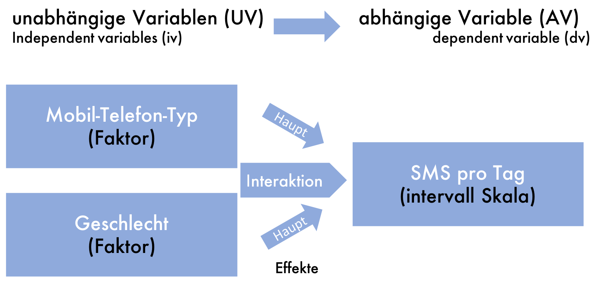
```


## In R (mit jmv-library):
```{r eval=F}
ANOVA(df_anova, dep = "value", factors = c("phone","gender"))
```

---
# Two-way ANOVA
```{r}
res <- ANOVA(df_anova, dep = "value", factors = c("phone","gender"),
             emMeans = list(c("phone", "gender")))
res$main
```
---
# Two-way ANOVA (plot)
```{r fig.height=5, warning=FALSE}
res$emm
```

---
# ANCOVA
```{r echo=FALSE, out.width="75%"}
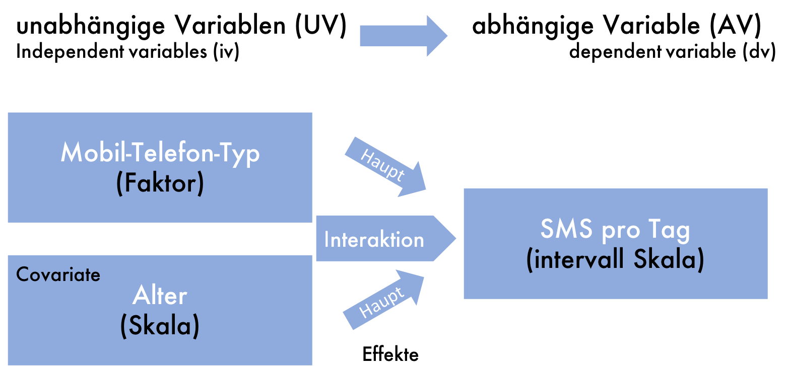
```

## In R (mit jmv-library):
```{r eval=F}
ancova(df_anova, dep = "value", factors = c("phone"), covs = "age")
```
---
# ANCOVA
```{r}
ancova(df_anova, dep = "value", factors = c("phone"), covs = "age")
```

---
# MANOVA
```{r echo=FALSE, out.width="75%"}

```

## In R (mit jmv-library):
```{r eval=F}
mancova(df_anova, deps = c("value", "value2"), factors = c("phone"))
```

---
# MANOVA
```{r eval=FALSE}
mancova(df_anova, deps = c("value", "value2"), factors = c("phone"))
```

<pre style="font-size:10pt">
```{r echo=FALSE}
mancova(df_anova, deps = c("value", "value2"), factors = c("phone"))
```
</pre>

---
# Two-way MANOVA
```{r echo=FALSE, out.width="75%"}
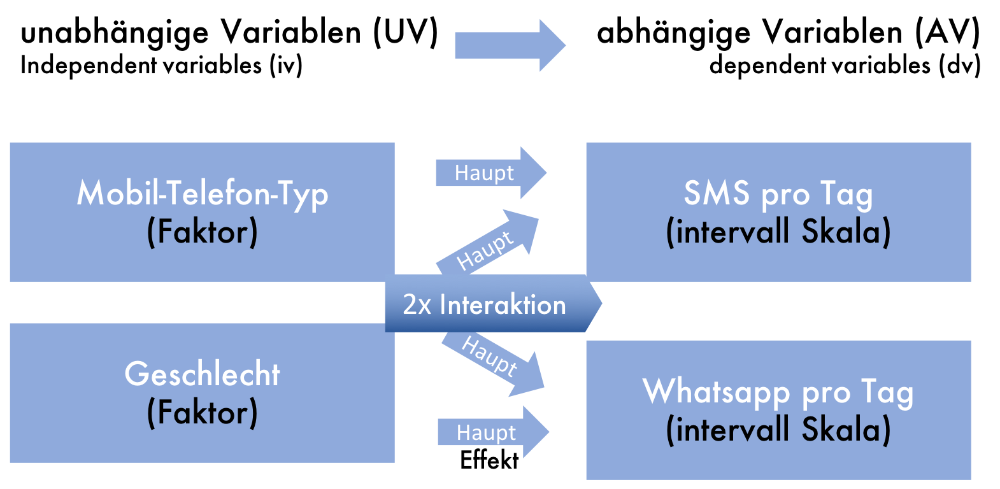
```

## In R (mit jmv-library):
```{r eval=F}
mancova(df_anova, deps = c("value", "value2"), factors = c("phone", "gender"))
```
---
# Two-way MANOVA
```{r eval=FALSE}
mancova(df_anova, deps = c("value", "value2"), factors = c("phone", "gender"))
```

<pre style="font-size:8pt">
```{r echo=FALSE}
mancova(df_anova, deps = c("value", "value2"), factors = c("phone", "gender"))
```
</pre>


---
# MANCOVA
```{r echo=FALSE, out.width="75%"}
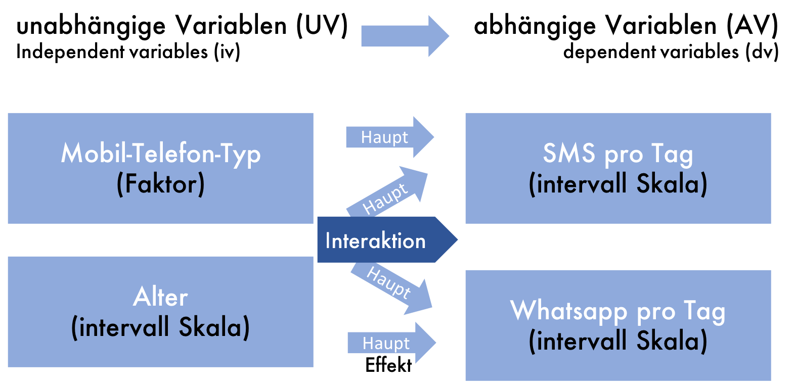
```

## In R (mit jmv-library):
```{r eval=F}
mancova(df_anova, deps = c("value", "value2"), factors = c("phone"),
        covs = c("age"))
```
---
# MANCOVA
```{r eval=FALSE}
mancova(df_anova, deps = c("value", "value2"), factors = c("phone"),
        covs = c("age"))
```

<pre style="font-size:8pt">
```{r echo=FALSE}
mancova(df_anova, deps = c("value", "value2"), factors = c("phone"), covs = c("age"))
```
</pre>


---
# MANOVA Beispiel
```{r echo=F}
df_manova = data.frame(grade=c(1.3, 1.6, 1.9, 2.3, 2.6, 2.9, 3.0, 3.4, 3.9, 5, 1.1, 1.5, 1.4, 2.6, 2.4, 2.8, 3.3, 3.2, 3.7, 4),
                       happiness=c(1.2, 1.4, 1.7, 2.0, 2.5, 2.8, 3.0, 3.2, 3.2, 4.5, 1.0, 1.7, 1.9, 2.3, 2.6, 3.2, 3.0, 3.4, 3.9, 5),
                       course=factor(c(rep(1,10), rep(2,10)), labels=c("SPSS", "r")))
```

.pull-left[
```{r echo=F}
df_manova %>% ggplot() +
  aes(x=course, y=happiness, shape = course, color = course) +
  geom_jitter(width = 0.1, size = 4) + theme_gray(base_size = 24)

```
]

.pull-right[
```{r echo=F}
df_manova %>% ggplot() +
  aes(x=course, y=grade, shape = course, color = course) +
  geom_jitter(width = 0.1, size = 4) + theme_gray(base_size = 24)

```
]

---
# MANOVA Beispiel

```{r echo=F}
df_manova %>% ggplot() +
  aes(x=grade, y=happiness, shape = course, color = course) +
  geom_point(size = 4) + theme_gray(base_size = 24)

```

---
# MANOVA Beispiel

```{r eval=F}
mancova(df_manova, factors=c("course"), deps=c("happiness", "grade"))

```

<pre style="font-size: 10pt;">
```{r echo=F}
mancova(df_manova, factors=c("course"), deps=c("happiness", "grade"))

```
</pre>

---
# Zusammenfassung

## Alpha-Fehler Kummulierung
- alpha-Schwellen Korrektur

## ANOVA
- PostHoc Test (Tukey)

## ANCOVA
- Intervall-skalierte Covariate

## MAN(C)OVA
- Mehrere abhängige Variablen und deren Interaktion


---
class: inverse, center, middle
---
class: inverse, center, middle
## .yellow[ [Zurück zur Übersicht](index.html)]
