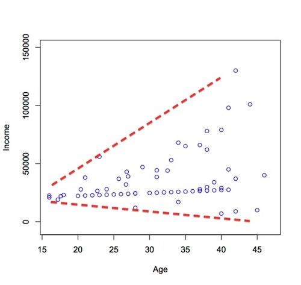
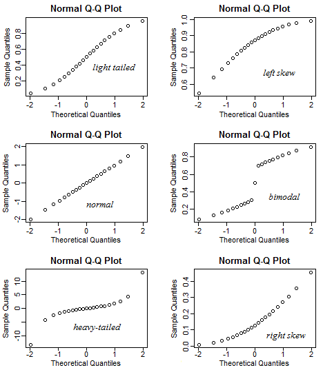
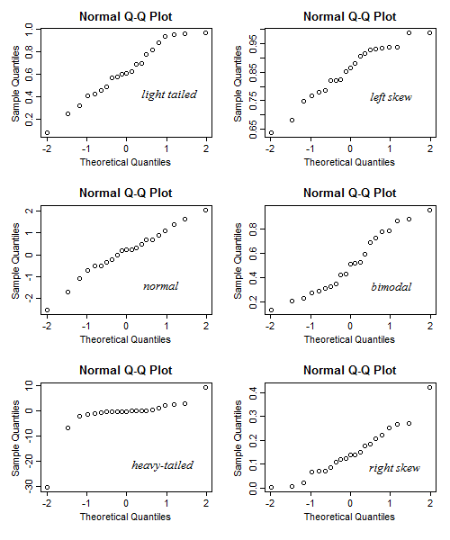
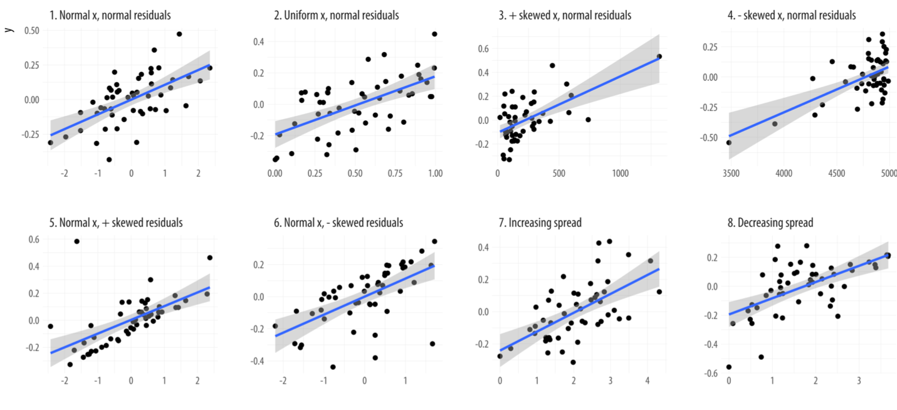
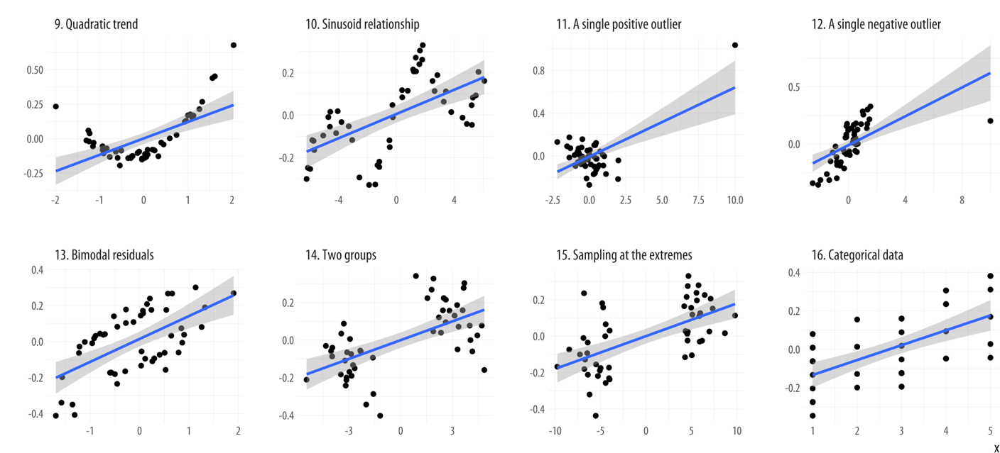
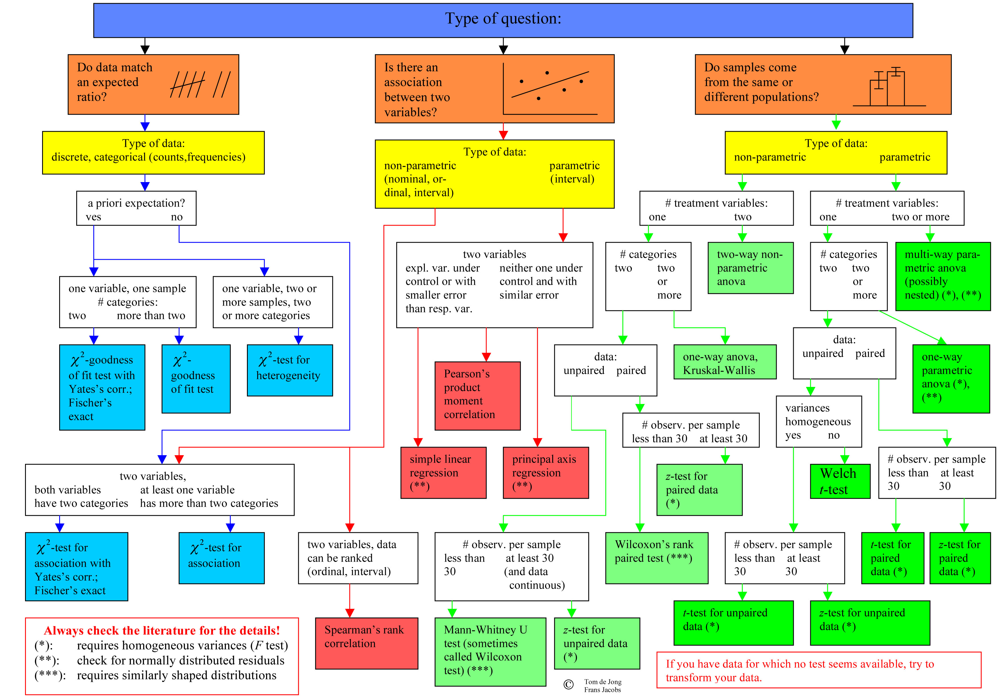

```{r setup, include=FALSE}
library(tidyverse)
library(datasets)
library(purrr)
library(scales)
library(forecast)
library(EnvStats)
library(jmv)
library(ggpubr)
```

## Korrelation

- Korrelation zum Beschreiben und Testen von Zusammenhängen
- Korrelationskoeffizient beschreibt "Stärke" des Zusammenhangs ($r \in [-1;1]$)
- Je nach Voraussetzung, unterschiedliche Verfahren.

**Korrelationstabelle**

```{r, echo=F}
library(jmv)
jmv::corrMatrix(data = dataforsocialscience::robo_care, vars = c("robo_bed", "robo_food", "robo_med"))
```

# Korrelationen können nicht für die Vorhersage genutzt werden.

---

## Vorhersage von Zusammenhängen

**Terminologie**

- abhängige Variable: Zielvariable, soll vorhergesagt werden
- unabhängige Variable, Prädiktor: Eingangsvariable, die für die Vorhersage verwendet werden soll.

**Lineares Modell**

- Wir beschreiben typischerweise "lineare" Zusammenhänge
- Je mehr $a$, desto mehr $b$.

Beispiel: Je größer die Person, desto größer die Füße. Pro cm Körpergröße, erwarten wir x cm Fußlänge.

---

## Lineares Modell

**Lineare Gleichung**

$$ y = b \cdot x + b_0 + \epsilon $$

- $y$ = abhängige Variable (hier: Fußlänge)
- $x$ = unabhängige Variable (hier: Körpergröße)
- $b, b_0$ = Koeffizienten (slope)
- $b_0$ = Intercept (y-Achsenabschnitt)
- $\epsilon$ = Fehlerterm

```{r include=FALSE}
set.seed(4)
df_sigma <- matrix(c(2,1,1,2), nrow = 2)
df <- MASS::mvrnorm(100, c(3,3), df_sigma, empirical = T) %>% data.frame()
```

---

## Beispiel: Lineare Gleichung

$$ y = 0.75 \cdot x + 1 + \epsilon $$

```{r, echo = F}
ggplot(data=data.frame()) + geom_abline(slope= 0.75, intercept = 1, linetype="dashed") + lims(x=c(-20,20), y=c(-20,20)) + geom_hline(yintercept = 0) + geom_vline(xintercept = 0) + labs(x="x", y="y") +
  geom_label(data=data.frame(label = "intercept = 1", x=0, y=0.8), aes(label=label, x=x, y=y), size=7) +
  geom_label(data=data.frame(label = "slope = 0.75", x=10, y=11), aes(label=label, x=x, y=y), size=7) +
  NULL
```

---

## Vorhersage von Daten mit linearer Regression

```{r, echo=FALSE, warning=F}
df <- data.frame(df)
df_sub <- df[1:10,]

model <- lm(data = df_sub, X2~X1)

coef_c <- model$coefficients[1]
coef_b <- model$coefficients[2]

plotformatter <- list(
  aes(X1, X2),
  geom_point(na.rm = T),
  labs(x = "X Variable", y = "Y Variable"),
  lims(x = c(-.5, 6), y = c(0, 5.5)),
  labs(title = "Lineare Regression")
)

df_sub %>% ggplot() + plotformatter
```

---

## Vorhersage — Regressionslinie

```{r, echo=FALSE, warning=F}
(
  df_sub %>% ggplot() +
    geom_abline(
      slope = coef_b,
      intercept = coef_c,
      color = "blue"
    ) +
    plotformatter +
    NULL -> p
)
```

---

## Vorhersage — Residuen

```{r, echo=F, warning=F}
p2 <- p
for (i in 1:10) {
  x1 <- df_sub[i, 1]
  y1 <- df_sub[i, 2]
  y2 <- predict(model, data.frame(X1 = x1))
  ydiff <- y1 - y2
  p2 <- p2 + geom_line(
    data = data.frame(x = c(x1, x1), y = c(y1, y2)),
    aes(x = x, y = y, group = i),
    color = "blue",
    inherit.aes = F
  )
}
p2
```

---

## Vorhersage — Residuen mit Beschriftung

```{r, echo=F, warning=F}
p2 <- p
for (i in 1:10) {
  x1 <- df_sub[i, 1]
  y1 <- df_sub[i, 2]
  y2 <- predict(model, data.frame(X1 = x1))
  ydiff <- y1 - y2
  p2 <- p2 + geom_line(
    data = data.frame(x = c(x1, x1), y = c(y1, y2)),
    aes(x = x, y = y, group = i),
    color = "blue",
    inherit.aes = F
  )
  p2 <-
    p2 + geom_label(label = paste("", round(ydiff, 2)),
                    x = x1,
                    y = y2 + (y1 - y2) / 2)
}
p2
```

---

## Vorhersage — Summe der Residuen

```{r, echo=F, warning=F}
p2 <- p
sum_y <- 0
for (i in 1:10) {
  x1 <- df_sub[i, 1]
  y1 <- df_sub[i, 2]
  y2 <- predict(model, data.frame(X1 = x1))
  ydiff <- y1 - y2
  sum_y <- sum_y + ydiff
  p2 <- p2 + geom_line(
    data = data.frame(x = c(x1, x1), y = c(y1, y2)),
    aes(x = x, y = y, group = i),
    color = "blue",
    inherit.aes = F
  )
  p2 <-
    p2 + geom_label(label = paste("", round(ydiff, 2)),
                    x = x1,
                    y = y2 + (y1 - y2) / 2)
}
  p3 <-
    p2 + geom_label(
      label = paste("SUM:", round(sum_y, 3)),
      x = 5,
      y = 1,
      size = 8
    )
p3
```

---

## Vorhersage — Quadratische Residuen

```{r, echo=F, warning=F}
p2 <- p
sum_y <- 0
for (i in 1:10) {
  x1 <- df_sub[i, 1]
  y1 <- df_sub[i, 2]
  y2 <- predict(model, data.frame(X1 = x1))
  ydiff <- y1 - y2
  sum_y <- sum_y + (ydiff * ydiff)
  p2 <- p2 + geom_line(
    data = data.frame(x = c(x1, x1), y = c(y1, y2)),
    aes(x = x, y = y, group = i),
    color = "blue",
    inherit.aes = F
  )
  p2 <-
    p2 + geom_label(label = paste("", round(ydiff * ydiff, 2)),
                    x = x1,
                    y = y2 + (y1 - y2) / 2)
}
p3 <-
    p2 + geom_label(
      label = paste("SUM:", round(sum_y, 2)),
      x = 5,
      y = 1,
      size = 8
    )
p3
```

---

## Vorhersage — mit Ausreißer

```{r, echo=F, warning=F}
df_sub <- df[1:10, ] %>% bind_rows(data.frame(X1 = 6, X2 = 7))
model <- lm(data = df_sub[c(-6), ], X2 ~ X1)

coef_c <- model$coefficients[1]
coef_b <- model$coefficients[2]

df_sub %>% ggplot() +
  geom_abline(slope = coef_b,
              intercept = coef_c,
              color = "blue") +
  plotformatter +
  NULL -> p
p2 <- p
sum_y <- 0
for (i in 1:10) {
  x1 <- df_sub[i, 1]
  y1 <- df_sub[i, 2]
  y2 <- predict(model, data.frame(X1 = x1))
  ydiff <- y1 - y2
  sum_y <- sum_y + (ydiff * ydiff)
  p2 <- p2 + geom_line(
    data = data.frame(x = c(x1, x1), y = c(y1, y2)),
    aes(x = x, y = y, group = i),
    color = "blue",
    inherit.aes = F
  )
  p2 <-
    p2 + geom_label(label = paste("", round(ydiff * ydiff, 2)),
                    x = x1,
                    y = y2 + (y1 - y2) / 2)
  p3 <-
    p2 + geom_label(
      label = paste("SUM:", round(sum_y, 2)),
      x = 5,
      y = 1,
      size = 8
    )
}
p3
```

---

## Lineare Regression in R

```{r,comment=NA}
df <- dataforsocialscience::robo_care
jmv::linReg(df, dep = c("robo_bed"), covs = c("cse"), blocks = list("cse"),
            r2Adj = T, stdEst = T, modelTest = T)
```

---

## Bericht

Die lineare Regression zeigt, dass ein Modell mit einem Prädiktor ($F(1,291)=21.3, p<.001, \text{adj.} r^2 = 0.065$) signifikant wird. Das Modell klärt somit 6,5% mehr Varianz auf, als der Mittelwert alleine. Ob sich jemand von einem Roboter ins Bett bringen möchte, kann mit folgender Formel vorhergesagt werden: $\text{robo\_bed} = 3.319 + 0.331 \cdot \text{cse}$.

Tabelle 1: Tabelle der linearen Regression robo_bed ~ cse

| Prädiktor | Koeff. B | SE | t | p | Stand. Koeff. β |
|:----------|--------:|---:|--:|--:|---------------:|
| Interzept | 3.319 | 0.3181 | 10.43 | < .001 | |
| cse | 0.331 | 0.0716 | 4.62 | < .001 | 0.261 |

---

## Vorteile der linearen Regression

- Vorhersage eines Parameters durch einen (oder mehrere) andere
- Mehrere Parameter: Multiple Regression

**Voraussetzungen:**

- Intervallskalierte Daten, insbesondere die abhängige Variable
- Normalverteilte Fehler
- Homoskedastizität (Gleichheit der Fehler über die Wertebereiche aller Prädiktoren)

**Heteroskedastizität**

```{r, echo=FALSE, out.width="50%"}

```

---

## Quantil-Quantil-Plot

App: <https://xiongge.shinyapps.io/QQplots/>

```{r figqq1, out.width="400px", echo=FALSE}

```

```{r figqq2, out.width="400px", echo=FALSE}

```

---

## QQ-Plots in R

QQ-Plot generieren:

```{r qqplot, eval=FALSE}
y <- rnorm(200)
qqnorm(y)
qqline(y)
```

```{r qqplot-out, ref.label="qqplot", echo=FALSE}
```

Variablen aus einem Dataframe holen:

```{r getdata, eval=FALSE}
y <- my_data %>% pull(variable_name)
```

---

## Test der Verteilung — Kolmogorov-Smirnov-Test

Testet, ob ein (oder zwei) Datensatz aus einer Verteilung kommt. Test wird signifikant, wenn es unwahrscheinlich ist.

```{r}
x <- rnorm(50, mean = 4, sd = 2)
y <- rnorm(30, mean = 4, sd = 2)
ks.test(x, y)
```

```{r}
x <- rnorm(50, mean = 4, sd = 2)
y <- rnorm(30, mean = 2, sd = 1)
ks.test(x, y)
```

---

## Test auf Normalität

```{r}
ks.test(x, "pnorm", mean(x), sd(x))
```

Test ist nicht signifikant, daher ist es wahrscheinlich, dass die Daten aus einer Normalverteilung kommen.

---

## Andere Probleme

```{r linreg_error1, echo=FALSE, out.width="100%"}

```

---

## Andere Probleme (2)

```{r error2, echo=FALSE, out.width="100%"}

```

# Parametrische vs. nicht-parametrische Verfahren

---

## Was sind Parameter?

$$
f_{\mu, \sigma}(x) = \frac{1}{\sigma \cdot \sqrt{2\pi}} \cdot e^{-\frac{1}{2} \cdot \left( \frac{x - \mu}{\sigma}\right)^2}
$$

Parameter der Normalverteilung $\mu$ und $\sigma$.

---

## Parametrische Verfahren

Bisherige Verfahren basieren auf der Verteilung der Daten

- t-Test setzt normalverteilte Daten voraus

Wir schätzen *Parameter* der Verteilung und vergleichen Daten mit idealen Verteilungen für Hypothesentests.

- Parameter: Mittelwert, Standardabweichung

**Vorteil:**

- einfache Verfahren
- relativ robust gegen Verletzung der Voraussetzung

---

## Nichtparametrische Verfahren

Nicht immer sind Parameter oder Verteilungen der Daten bekannt.

- Nicht-parametrische Verfahren setzen diese nicht voraus.

**Beispiel:**

- t-Test und Mann-Whitney U test
- Pearson und Spearman rank correlation
- lineare Regression und ordinale Regression
- ANOVA und Kruskal-Wallis Test

---

## Wann welcher Test?



---

## Tools zum Lernen oder Nachschlagen

Wann welche Methode?

- <https://statkat.com> (Englisch)
- <https://www.methodenberatung.uzh.ch/de.html> Methodenberatung Uni Zürich

Alternative Softwarelösungen zu R:

- SPSS (Nachteil: Kosten, Reproducibility)
- Jamovi (Nachteil: kein Data Cleaning)
- JASP (Nachteil: Fokus auf Bayes'sche Statistik)
- Stata (Nachteil: Kosten)

# Multiple Lineare Regression

---

## Multiple lineare Regression — Modell 1

```r
jmv::linReg(df, dep = c("robo_bed"), covs = c("cse", "age"),
             blocks = list("cse", "age"), r2Adj = T, stdEst = T, modelTest=T)
```

```{r echo=FALSE}
df <- dataforsocialscience::robo_care
result <- jmv::linReg(df, dep = c("robo_bed"), covs = c("cse", "age"), blocks = list("cse", "age"), r2Adj = T, stdEst = T, modelTest = T)
result$models[[1]]
```

---

## Multiple lineare Regression — Modell 2

```{r echo=FALSE}
result$models[[2]]
```

---

## Multiple lineare Regression — Modellvergleich

```{r echo=FALSE}
result$modelFit
result$modelComp
```

---

## Base R Lineare Regression + ggplot

```{r}
cars.lm <- lm(mpg ~ disp, data = mtcars)
summary(cars.lm)
```

```{r}
ggplot(mtcars) + aes(x=disp, y = mpg) +
  geom_point() + geom_smooth(method="lm")
```

---

## Zusammenfassung

Zusammenhangshypothesen können mit Korrelation und linearer Regression untersucht werden.

- Korrelation misst nur die Stärke und Richtung: Korrelationskoeffizient
- Lineare Regression trifft eine Vorhersage: Lineare Gleichung
- Lineare Regression kann einfach auf mehrere Variablen erweitert werden.
