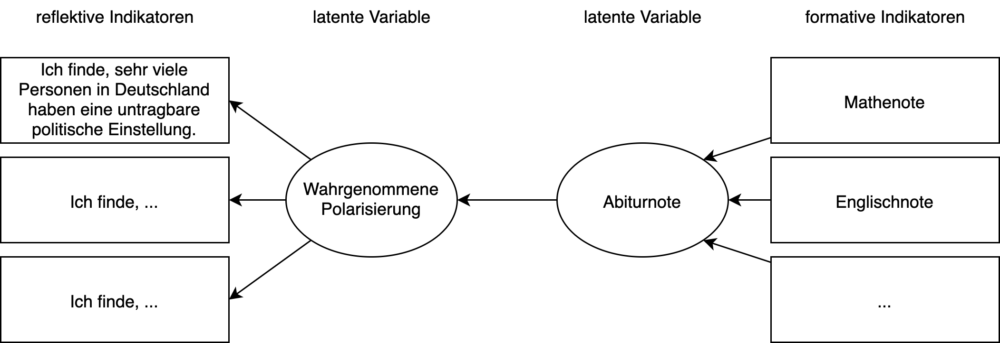
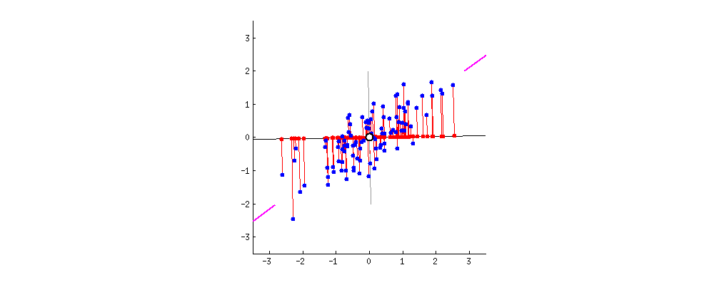

```{r setup, include=FALSE}
library(tidyverse)
library(datasets)
library(kableExtra)
library(purrr)
library(scales)
library(forecast)
library(likert)
library(jmv)
library(knitr)
library(dataforsocialscience)
library(GGally)
set.seed(123)

dataforsocialscience::robo_care %>% select(starts_with("human")) %>% select(1:5) -> df_part

agree <- function(x) {
  factor(as.character(x), levels = 1:6, ordered = T,
         labels = c("strongly disagree",
                    "disagree",
                    "rather disagree",
                    "rather sagree",
                    "agree",
                    "strongly agree"))
}

df_part %>% mutate_all(agree) %>% as.data.frame() -> df_lik
```

```{r child="header.Rmd"}
```

# Wiederholung
## Skalenniveaus, Messniveaus

--

  - Nominal, Ordinal, Intervall
  - `factor`, `ordered`, `numeric`

--

## Nominal
- Test auf Gleichheit

--

## Ordinal
- Ordnungen

--

## Intervall
- Abstände und Relationen
- Für viele Verfahren benötigt (z.B. lineare Regression)

---
# Forschungsmodell
## Notation
Forschungsfrage: Wirkt sich die Schulnote auf die wahrgenommene Polarisierung aus?




---
# Null-Hypothesen Signifikanz Tests

## Unterschiedshypothesen
1. t-Test
2. Varianzanalyse

## Zusammenhangshypothesen
1. Korrelation
2. Lineare Regression

> Benötigen intervallskalierte Daten


---
# Schwierigkeiten für Medieninformatik
- Womit können wir intervallskalierte Daten messen?

--

## Likert Skalen
- Entwickelt von Rensis Likert (5-Point Likert Scale) zum Messen von Einstellungen.
- Einzelne Items werden ordinal gemessen:
  - z.B.: KUT: 8 Items
- Dabei sind die Stufen benannt:
  - 5P: Stimme sehr zu, stimme zu, neutral, stimme nicht zu, stimme gar nicht zu
  - 6P: Stimme sehr zu, stimme zu, stimme eher zu, stimme eher nicht zu, stimme nicht zu, stimme gar nicht zu
- Skalenstufen werden ganzzahligen Werten zugeordnet (z.B.: 0-4, 0-5, 1-6, etc.)

---
# Gerarde oder ungerade?
## Gerade Likert-Skalen
- Forced choice
- Vermeiden von Antworten wird reduziert

## Ungerade Likert-Skalen
- Möglichkeit keine Meinung abzugeben
- Möglichkeit neutrale Meinung abzugeben.


## "Keine Angabe" als N+1te Option

---
# Ordinal oder Intervall
Ob einzele Items Likert-Skalen ordinal oder intervall-skalierte Daten liefert, wird immernoch diskutiert.

## Wo ist der Unterschied?

--

- Willkürliche Wahl der "Labels"

--

- Gleichabständigkeit?

--

- Auswahl der Verfahren
  - ordinale vs. lineare Regression
  - t-Test vs. Wilcoxon signed Rank test

--

## Ab 4 (besser 8) Items intervallskaliert
- Summative Skala
- Zentraler Grenzwertsatz


---
# Visuelle Analyse von Likert Skalen

```{r echo=T, fig.height=5}
lik <- df_lik %>% likert()
plot(lik, type = "bar")
```
Gallerie: https://github.com/jbryer/likert

---
# Numerische Analyse

```{r echo=T}
psych::describe(df_lik)
```


---
class: inverse, center, middle
# Sind das wirklich alles verschiedene Dinge?

---
class: center, middle
# Skalenbildung
 1. Variablenauswahl (korrelierende Variablen)

 2. Faktoranalyse (Principal Component Analysis)

 3. Reliabilitätsanalyse (Cronbach's Alpha)

---
# Skalenbildung

- Items die stark korrelieren kommen in Betracht

```{r}
jmv::corrMatrix(df_part, vars = names(df_lik))
```


---
# Faktorenanalyse
Die Faktorenanalyse prüft ob die Varianz mehrere Variablen eine (oder mehrere) gemeinsame Dimensionen beschreiben.

## Beispiel: Big Five Persönlichkeit
- Ich bin eher zurückhaltend, reserviert.
- Ich schenke anderen leicht Vertrauen, glaube an das Gute im Menschen.
- Ich bin bequem, neige zur Faulheit.
- Ich bin entspannt, lasse mich durch Stress nicht aus der Ruhe bringen.
- Ich habe nur wenig künstlerisches Interesse.
- Ich gehe aus mir heraus, bin gesellig.
- Ich neige dazu, andere zu kritisieren.
- Ich erledige Aufgaben gründlich.
- Ich werde leicht nervös und unsicher.
- Ich habe eine aktive Vorstellungskraft, bin fantasievoll.


---
# Faktorenanalyse
Die Faktorenanalyse prüft ob die Varianz mehrere Variablen eine (oder mehrere) gemeinsame Dimensionen beschreiben.

## Beispiel: Big Five Persönlichkeit
- Ich bin eher zurückhaltend, reserviert. (Extraversion)
- Ich schenke anderen leicht Vertrauen, glaube an das Gute im Menschen. (Verträglichkeit)
- Ich bin bequem, neige zur Faulheit. (Gewissenhaftigkeit)
- Ich bin entspannt, lasse mich durch Stress nicht aus der Ruhe bringen. (Neurotizismus)
- Ich habe nur wenig künstlerisches Interesse. (Offenheit)
- Ich gehe aus mir heraus, bin gesellig. (Extraversion)
- Ich neige dazu, andere zu kritisieren. (Verträglichkeit)
- Ich erledige Aufgaben gründlich. (Gewissenhaftigkeit)
- Ich werde leicht nervös und unsicher. (Neurotizismus)
- Ich habe eine aktive Vorstellungskraft, bin fantasievoll. (Offenheit)
---
# Faktorenanalyse
- Exploratives, strukturentdeckendes Verfahren

Erstmal 2-Dimensionaler Fall:
- Multivariate Daten, die korrelieren

```{r, warning=FALSE, fig.height=5}
psych::bfi %>% ggplot() + aes(C1, C2) + geom_jitter() + geom_smooth(method = "lm") + labs(caption="Jitter-Plot 10%")
```

---
# Faktoren-Analyse
## Was passiert da eigentlich?
Rotation der Hauptachsen zur Reduktion der Streuung in der Nebenachse

---
# Faktorenanalyse durchführen

```{r eval=FALSE, message=FALSE, warning=FALSE, include=TRUE}
jmv::pca(df_part, vars = names(df_part),
         screePlot = TRUE,
         eigen = TRUE,
         kmo = TRUE,
         bartlett = TRUE,
         factorCor = TRUE)

```

---
# Faktorenanalyse durchführen
## Vorraussetzungen prüfen
- Bartlett's Test muss signifikant werden
- KMO MSA > 0.8
```{r eval=T, message=FALSE, warning=FALSE, echo=F}
res <- jmv::pca(df_part, vars = names(df_part),
         eigen = T,
         kmo = T,
         bartlett = T,
         factorCor = T)
res$assump


```

---
# Faktorenanalyse durchführen
## Eigenwerte
- Aufgeklärte Varianz pro Faktor (Komponente)
- Hinweis auf Anzahl Faktoren
```{r eval=T, message=FALSE, warning=FALSE, echo=F}
res$eigen


```
---
# Faktorenanalyse durchführen
## Korrelationen der Faktoren
- Stark korrelierende Faktoren können problematisch sein
- Hängt von der Rotation ab: Varimax
```{r eval=T, message=FALSE, warning=FALSE, echo=F}
res$factorStats

```

---
# Faktorenanalyse durchführen
## Ladungen der Items auf Faktoren
- Ladungen sollten groß sein (>0.8)
- Uniqenuess zeigt an, welcher Varianzanteil im Faktor verloren geht.
```{r eval=T, message=FALSE, warning=FALSE, echo=F}
res$loadings

```

---
# Faktorenanalyse durchführen
## Screeplot
- Wo unterschreiten die Eigenwerte die simulierten Daten
```{r echo=F, message=FALSE, warning=FALSE, fig.height = 5}
jmv::pca(df_part, vars = names(df_part), screePlot = T) -> model

model$eigen$screePlot

```


---
class: center, middle
# Faktoren identifiziert!
Nächster Schritt: summative Skala bilden!

Items weglassen?

---
# Reliabilitätsanalyse

- Prüft, ob die Skala in sich reliabel misst (interne Reliabilität).
- Passen die Items "zusammen".

- Gemessen wird "Cronbach's alpha".

## Schwellwerte Cronbach's alpha
 Internal consistency
- 0.9 ≤ α	Excellent
- 0.8 ≤ α < 0.9	Good
- 0.7 ≤ α < 0.8	Acceptable
- 0.6 ≤ α < 0.7	Questionable
- 0.5 ≤ α < 0.6	Poor
- α < 0.5	Unacceptable

---
# Reliabilität in R
```{r}
psych::alpha(df_part)
```

---
# Beispiel mit mehr Faktoren
Datensatz `bfi` aus dem `psych` paket

```{r paged.print=TRUE}

psychTools::bfi.dictionary %>% select(Item) %>%  kable()
```

---
# Beispiel mit mehr Faktoren
Datensatz `bfi` aus dem `psych` paket
```{r eval=T, message=FALSE, warning=FALSE, echo=F}
df <- psych::bfi %>% select(-gender, -education, -age)
model <- psych::pca(df, nfactors = 5)
psych::fa.diagram(model)
```


---
# Beispiel mit mehr Faktoren
Datensatz `bfi` aus dem `psych` paket

```{r eval=T, message=FALSE, warning=FALSE, echo=F}
res <- jmv::pca(df, vars = names(df),
         eigen = T,
         kmo = T,
         bartlett = T,
         factorCor = T)
res$assump

```

---
# Eigenwerte
```{r eval=T, message=FALSE, warning=FALSE, echo=F}
res$eigen
```


---
# Screeplot

```{r eval=T, message=FALSE, warning=FALSE, echo=F}
jmv::pca(df, vars = names(df), screePlot = T) -> model
model$eigen$screePlot
```

---
# Ladungen
```{r eval=T, message=FALSE, warning=FALSE, echo=F}
res$loadings

```

---
class: inverse, center, middle
# .yellow[Explorative Faktoranalyse]

---
# Faktorenanalyse
Die Faktorenanalyse prüft ob die Varianz mehrere Variablen eine (oder mehrere) gemeinsame Dimensionen beschreiben.

---
class: inverse, center, middle

# Wir brauchen Daten

Fiktiver Fragebogen

---

# 4 Fragen:
```{r figureoutputc1, echo=FALSE, out.width="80%"}

```

Wie gut schmecken diese Schokokekse (Schieberegler 1-6)


---

# 4 Fragen:
```{r figureoutputc2, echo=FALSE, out.width="80%"}

```
Wie gut schmecken diese Butterkekse (Schieberegler 1-6).

---

# 4 Fragen:
```{r figureoutputb1, echo=FALSE, out.width="80%"}

```

Wie gut schmeckt dieser Burger (1-6).

---

# 4 Fragen:
```{r figureoutputb2, echo=FALSE, out.width="80%"}

```
Wie gut schmeckt dieser Cheesburger (1-6).

---
# Ergebnisse

1. Proband

```{r echo=FALSE, paged.print=TRUE}
sample_size  <- 1
fdata <- data.frame(
  pseudonym = c("CookieLover"),
  cookie1 = rnorm(sample_size, 5, 0.5),
  cookie2 = rnorm(sample_size, 5, 0.5),
  burger1 = rnorm(sample_size, 2, 0.5),
  burger2 = rnorm(sample_size, 2, 0.5)
) %>% bind_rows(data.frame(
  pseudonym = c("Hmbrglr"),
  cookie1 = rnorm(sample_size, 2, 0.5),
  cookie2 = rnorm(sample_size, 2, 0.5),
  burger1 = rnorm(sample_size, 5, 0.5),
  burger2 = rnorm(sample_size, 5, 0.5)
)) %>% bind_rows(data.frame(
  pseudonym = c("No, this is Patrick"),
  cookie1 = rnorm(sample_size, 5, 0.5),
  cookie2 = rnorm(sample_size, 5, 0.5),
  burger1 = rnorm(sample_size, 5, 0.5),
  burger2 = rnorm(sample_size, 5, 0.5)
))


fdata %>% head(1) %>% knitr::kable(digits = 3)
```
--


```{r figureoutputcookiemon, echo=FALSE, out.width="40%"}

```

---
# Ergebnisse

Nächster Proband

```{r echo=FALSE, paged.print=TRUE}
fdata %>% head(2) %>% knitr::kable()
```

--

```{r figureoutputburglar, echo=FALSE, out.width="40%"}

```


---
# Ergebnisse

Nächster Proband

```{r echo=FALSE, paged.print=TRUE}
fdata %>% knitr::kable()
```

--

```{r figureoutputpatrick, echo=FALSE, out.width="40%"}

```

---


# Daten plotten

.pull-left[

```{r echo=FALSE}
fdata %>% ggplot() +
  aes(x = burger1, y = cookie1, color = pseudonym) +
  geom_point(size = 5) +
  scale_x_continuous(limits = c(0,7)) +
  scale_y_continuous(limits = c(0,7)) +
  theme_bw(base_size = 24)
```
]

--

.pull-right[

```{r echo=FALSE}
fdata %>% ggplot() +
  aes(x = burger2, y = cookie2, color = pseudonym) +
  geom_point(size = 5) +
  scale_x_continuous(limits = c(0,7)) +
  scale_y_continuous(limits = c(0,7)) +
  theme_bw(base_size = 24)
```
]

---
class: center, middle

# Wir haben selten nur 3 Probanden

---

# 200 Probanden

.pull-left[
```{r echo=FALSE}
sample_size <- 1000

cookie_monsters <- data.frame(
  cookie1 = rnorm(sample_size, 5, 0.5),
  cookie2 = rnorm(sample_size, 5, 0.5),
  burger1 = rnorm(sample_size, 2, 0.5),
  burger2 = rnorm(sample_size, 2, 0.5)
)

burglars <- data.frame(
  cookie1 = rnorm(sample_size, 2, 0.5),
  cookie2 = rnorm(sample_size, 2, 0.5),
  burger1 = rnorm(sample_size, 5, 0.5),
  burger2 = rnorm(sample_size, 5, 0.5)
)

slimers <- data.frame(
  cookie1 = rnorm(sample_size, 5, 0.5),
  cookie2 = rnorm(sample_size, 5, 0.5),
  burger1 = rnorm(sample_size, 5, 0.5),
  burger2 = rnorm(sample_size, 5, 0.5)
)


my_data <- cookie_monsters %>%
  bind_rows(burglars) %>%
  bind_rows(slimers)

my_data %>%
  ggplot() +
  aes(x = cookie1, y = burger1) +
  geom_point(alpha = 0.5) +
  scale_x_continuous(limits = c(0,7)) +
  scale_y_continuous(limits = c(0,7)) +
  theme_bw(base_size = 24)
```
]

.pull-right[
```{r}
my_data %>% ggplot() +
  aes(x = cookie2, y = burger2) +
  geom_point(alpha = 0.5) +
  scale_x_continuous(limits = c(0,7)) +
  scale_y_continuous(limits = c(0,7)) +
  theme_bw(base_size = 24)
```

]

---

# Scatterplotmatrix

```{r}

library(GGally)
cookie_monsters %>%
  bind_rows(burglars) %>%
  bind_rows(slimers) %>%
  ggpairs(diag = "blankDiag", progress = FALSE,
          lower = list(continuous = wrap("smooth", alpha = 0.1, size = 0.1)))

```


---
# Explorative Faktoranalyse

## Frage:
Liegt hinter den gemesseen Variablen ein Faktoren-Modell?
Erklärt eine tieferliegende latente Variable, die manifesten Variablen?

> z.B.: Vorliebe für süß und salzig?

--

## Zwei Verfahren

- Explorative Faktoranalyse (EFA)
- Hauptkomponentenanalyse (PCA)


---
# Explorative Faktoranalyse
```{r echo = TRUE}
my_data %>% jmv::efa()
```
Uniqueness: Varianz, die nur in dieser Variable steckt

---
# Hauptkomponentenanalyse
```{r echo=TRUE}
my_data %>% jmv::pca()
```

Uniqueness: Varianz, die nur in dieser Variable steckt

---


# Faktoranalyse
Egal, ob mit PCA oder EFA, folgende Schritte müssen gemacht werden.

## Darf ich die Faktoranalyse durchführen?
1. Bartlett-Test (Sphärizität)
2. KMO-Test (Stichprobengüte)

## Faktoranalyse durchführen

1. Scree-Plot sichten
1. Ladungstabelle sortieren und prüfen
2. Aufgeklärte Varianz prüfen

## Scoring berechnen

---
# Bartlett-Test auf Sphärizität
Sind meine Daten multivariat normalverteilt?

```r
my_data %>% jmv::efa(bartlett = T)
```

```{r}
res <- my_data %>% jmv::efa(bartlett = T)
res$assump
```
Test muss signifikant werden! Sonst, keine Faktoranalyse!

--

> Die Daten weisen hinreichende Sphärizität für eine Faktoranalyse auf (Bartlett-Test $\chi^2(6) = 10287, p \lt .0001$).

---
# Kaiser-Meyer-Olkin Test
Sind meine Variablen in der Stichprobe hinreichend korreliert und misst jede Variable etwas "eigenes" ?

```r
my_data %>% jmv::efa(kmo = T)
```

```{r}
res <- my_data %>% jmv::efa(kmo = T)
res$assump
```
Werte müssen > 0.6 sein. Idealerweise > 0.8. Sonst, Items weglassen.

--

> Die Daten haben eine hinreichende Stichprobengüte und sind für eine Faktoranalyse geeignet (KMO > 0.6 und MSA = 0.614).

---

# Scree-Plot sichten
Wieviele Faktoren bekommen wir?
```r
my_data %>% jmv::efa(screePlot = TRUE)
```


```{r, fig.asp=0.681}
res <- my_data %>% jmv::efa(screePlot = T)
res$eigen
```
## Parallelen-Analyse
Wo schneiden sich die Linien?
---
# Ladungstabelle sortieren und prüfen

```{r echo=TRUE}
my_data %>% jmv::efa(hideLoadings = 0.0, sortLoadings = TRUE)
```
---
# Ladungstabelle sortieren und prüfen

```{r echo=TRUE}
my_data %>% jmv::efa(hideLoadings = 0.1, sortLoadings = TRUE)
```

---
# Ladungstabelle sortieren und prüfen

```{r echo=TRUE}
my_data %>% jmv::efa(hideLoadings = 0.3, sortLoadings = TRUE)
```

---
# Ladungstabelle sortieren und prüfen

```{r echo=TRUE}
my_data %>% jmv::efa(sortLoadings = TRUE)
```

--

## Wofür stehen die Faktoren?

---
# Aufgeklärte Varianz prüfen

```r
my_data %>% jmv::efa(factorSummary = T)
```


```{r}
res <- my_data %>% jmv::efa(factorSummary = T)
res$factorStats
```

--

> Das Modell mit 2 Faktoren erklärt 89% der Varianz.


---

# Scoring berechnen
Cronbach's alpha prüfen (idealerweise > 0.8).

```{r echo=T}
res <- my_data %>%
  select(cookie1, cookie2) %>%
  psych::alpha(check.keys = T)
summary(res)
```

--
## Items weglassen?

```{r echo=T}
res$alpha.drop
```

--

> Die Skala Cookie zeigt eine sehr gute Reliabilität (Cronbach's $\alpha = .943$).


---
# Reliabilitätsanalyse

- Prüft, ob die Skala in sich reliabel misst (interne Reliabilität).
- Passen die Items "zusammen".

- Gemessen wird "Cronbach's alpha".

## Schwellwerte Cronbach's alpha
 Internal consistency
- 0.9 ≤ α	Excellent
- 0.8 ≤ α < 0.9	Good
- 0.7 ≤ α < 0.8	Acceptable
- 0.6 ≤ α < 0.7	Questionable
- 0.5 ≤ α < 0.6	Poor
- α < 0.5	Unacceptable

---
# Score an Daten anhängen

```{r echo=T, paged.print=TRUE}
my_new_data <- data.frame(my_data, cookie = res$scores)
my_new_data

```
---

# Alternative mit `hcictools`

Wenn beispielsweise etablierte Skalen eingesetzt werden.

```r
my_new_data <- my_data %>%
  hcictools::auto_score("cookie") %>%
  hcictools::auto_score("burger")
```

```{r include=FALSE}
my_new_data <- my_data %>%
  hcictools::auto_score("cookie") %>%
  hcictools::auto_score("burger")
```

```{r echo=T}
my_new_data %>% sample_n(5) %>% kable()
```


---
class: center, inverse, middle
# Anwendung mit realen Daten


---
# Anwendungsbeispiel
Frage: Gibt es eine Faktorstruktur in der Akzeptanz menschlicher Pflege?

Zuerst filtern wie die Spalten, die wir brauchen.

```{r echo = TRUE}
robo_care_human <- robo_care %>% select(starts_with("human"))
```

--

Dann Voraussetzungen prüfen:
1. Bartlett-Test auf Sphärizität
2. Kaiser-Meyer-Olkin Kriterium (Stichprobeneignung)

--

2. ScreePlot sichten

--

3. Ladungstabelle sortieren und prüfen

--

4. Aufgeklärte Varianz prüfen

--
5. Reliabilitätsanalyse

--
Berichten!

---
# 1. Schritt Voraussetzungen prüfen

.pull-left[
```{r echo=TRUE}
res <- robo_care_human %>%
  jmv::efa(bartlett = T)

 res$assump
```
]

.pull-right[
```{r echo=TRUE}
res <- robo_care_human %>%
  jmv::efa(kmo = T)

 res$assump
```
]

---
# Screeplot sichten

```{r echo=TRUE, fig.asp=0.681}
res <- robo_care_human %>%
  jmv::efa(screePlot = T)

res$eigen
```

---
# Ladungstabelle sortieren und prüfen
```{r echo=TRUE, fig.asp=0.681}
loads <- robo_care_human %>%
  jmv::efa(hideLoadings = 0.3, sortLoadings = T)

loads$loadings
```

---
# Varianzaufklärung prüfen

```{r}
res <- robo_care_human %>% jmv::efa(factorSummary = T)
res$factorStats
```

---
# Reliabilitätsanalyse 1/3

```{r echo=TRUE}
res <- robo_care_human %>%
  select(human_wash, human_toilet, human_body, human_bath) %>%
  psych::alpha(check.keys = T)
summary(res)
```

# Items weglassen?
```{r echo=TRUE}
res$alpha.drop
```

---
# Reliabilitätsanalyse 2/3

```{r echo=TRUE}
res <- robo_care_human %>%
  select(human_hair_cut, human_face, human_hair_wash, human_mass) %>%
  psych::alpha(check.keys = T)
summary(res)
```

# Items weglassen?
```{r echo=TRUE}
res$alpha.drop
```

---
# Reliabilitätsanalyse 3/3

```{r echo=TRUE}
res <- robo_care_human %>%
  select(human_bed, human_med, human_food) %>%
  psych::alpha(check.keys = T)
summary(res)
```

# Items weglassen?
```{r echo=TRUE}
res$alpha.drop
```


---
# Berichten


Mit den Variablen zur Akzeptanz menschlicher Pflege wurde ein explorative Faktoranalyse durchgeführt.
Die Daten weisen eine hinreichende Sphärizität auf (Bartlett-Test $\chi^2(55)=2075, p \lt .0001$).
Zusätzlich ist die Stichprobeneignung gegeben (KMO > 0.8 und MSA = 0.892).
--
Dabei konnten drei Faktoren ermittelt werden (siehe Table: Faktorenladungen).
Der erste Faktor (KNP) bestimmt dabei vornehmlich die Akzeptanz für körpernahe Pflege (Waschen, Toilettengang, Körper waschen, Baden). Die Skala zeigt eine sehr gute Reliabilität (Cronbach's $\alpha = .89$).
Der zweite Faktor (SERV) beeinflusst die Akzeptanz für körpernahe Pflege, die typischerweise auch als Dienstleistung angeboten wird (Haare schneiden, Haare waschen, Massagen, Gesichtspflege). Die Skala zeigt eine sehr gute Reliabilität (Cronbach's $\alpha = .86$).
Der dritte Faktor (CARE) beeinflust die Akzeptanz für allgemeine Pflegetätigkeiten (ins Bett bringen, Medikamente geben, füttern lassen). Die Skala zeigt eine sehr gute Reliabilität (Cronbach's $\alpha = .8$).
Das Modell mit drei Faktoren konnte in Summe 66% der Varianz der Items aufklären.


---
# Ladungstabelle

```{css, echo = FALSE}
.teeny .remark-code { /*Change made here*/
  font-size: 70% !important;
}
div.tiny { /*Change made here*/
  font-size: 70% !important;
}
```

.tiny[
```{r echo=T}
options(knitr.kable.NA = '')
loads$loadings$asDF %>%
  tibble() %>%
  kable(digits = 2, caption = "Faktorladungen der Items für menschliche Pflege",
        col.names = c("Items", "KNP", "SERV", "CARE", "Uniqueness"))
```
]


---
class: center, middle, inverse
# Moment, da war noch was

---
# Rotationen

## Was passiert da eigentlich?
Rotation der Hauptachsen zur Reduktion der Streuung in der Nebenachse


---
```{css, echo = FALSE}
.tiny .remark-code { /*Change made here*/
  font-size: 80% !important;
}
.teeny .remark-code-line{ /*Change made here*/
  font-size: 80% !important;
}
```


# Oblimin Rotation

Faktoren dürfen nachher korrelieren!

.tiny[
```{r echo=TRUE}
robo_care_human %>% jmv::efa(rotation = "oblimin", factorCor = T)
```
]
---
# Varimax Rotation

Faktoren dürfen nachher nicht korrelieren!

.tiny[
```{r echo=TRUE}
robo_care_human %>% jmv::efa(rotation = "varimax", factorCor = T)
```
]

---
# Zusammenfassung

## Likert-Skalen
- Vor- und Nachteile
- Ordinal oder Intervall

## Faktoranalyse
- EFA vs. PCA
- Vorraussetzungen: KMO und Bartlett
- Eigenwerte und Screeplot
- Ladungen

## Reliabilitätsanalyse
- Cronbach's alpha

---
class: inverse, center, middle
---
class: inverse, center, middle
## .yellow[ [Zurück zur Übersicht](index.html)]
