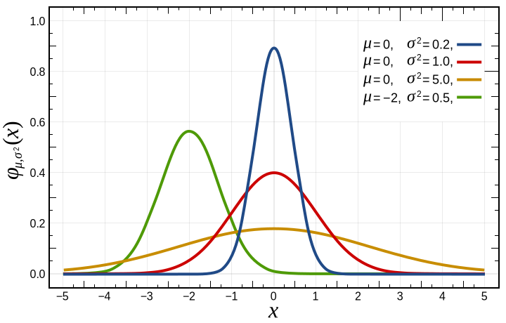
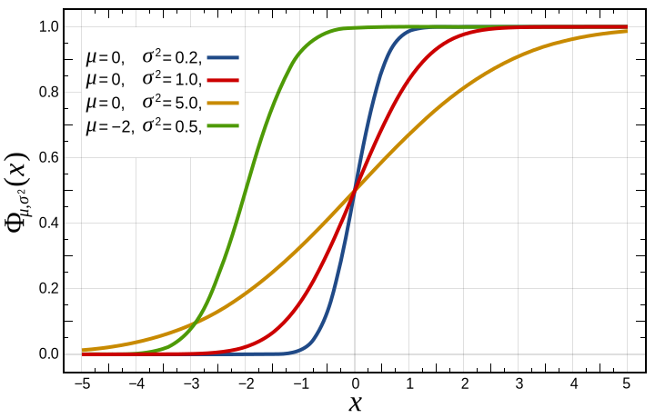
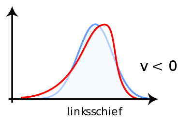
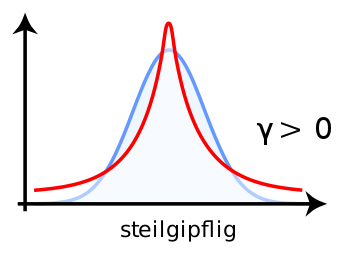
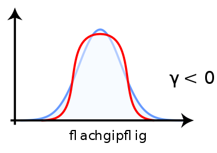

## Wiederholung

### Skalenniveaus
Nomial > Ordinal > Intervall

### Deskriptive Statistik
Zentrale Tendenz - Mittelwert:

$$M=\frac{1}{n}\sum_{i=1}^nx_i$$

Dispersion - Varianz und Standardabweichung:

$$\sigma ^{2}={\frac {1}{N}}\sum \limits _{i=1}^{N}(x_{i}-\mu )^{2}$$

$$SD=+{\sqrt {{\frac {1}{n-1}}\sum \limits _{i=1}^{n}\left(x_{i}-{\overline {x}}\right)^{2}}}$$


---

## Was ist Wahrscheinlichkeit?

### Wahrscheinlichkeit und Zufall
*Die Wahrscheinlichkeit (Probabilität) ist eine Einstufung von Aussagen und Urteilen nach dem Grad der Gewissheit (Sicherheit).*

### Was ist überhaupt Zufall?
- Gibt es überhaupt Zufall? Deterministische Welt?
- Gibt es unterschiedliche Arten von Zufall?


### Beispiele:

- Münzwurf
- Würfelwurf
- Eingehende Nachrichten
- Körpergröße
- Anzahl Einwohner pro Stadt

---

## Münzwurf oder Bernoulli-Verteilungen
- Konvention: *p* Probability.
$$p \in [0;1]$$
- *p = 0.5* bedeutet 50% Wahrscheinlichkeit, *p = 0.05* bedeute 5% Wahrscheinlichkeit

Trifft ein Ereignis ein oder nicht? Werfen wir Kopf (oder Zahl).
- Faire Münze *p = 0.5*. Wenn *p = 1*, dann immer Kopf.

- Gegenwahrscheinlichkeit: *(1 - p)*
  - *p = 0.3* , dann *(1 - p) = 0.7*, also 30% Kopf, 70% Zahl.

- Ereignisse sind exklusiv => Summe der Wahrscheinlichkeiten ist 1.


## Bernoulli ist nur ein Event. Ein Münzwurf.
- Mehrfacher Münzwurf, Anzahl Kopf -> Binomial-Verteilung


---

## Plot der Verteilungsfunktion von Bernoulli

## Fairer Münzwurf (*p = 0.5*)
<!-- -->

## Unfairer Münzwurf (*p = 0.25*)
<!-- -->

## Fairer Münzwurf (*p = 0.5*) - Binomial 9x
<!-- -->

---

## Würfelwurf oder Gleichverteilung
Einfaches Beispiel: 6-seitiger fairer Würfel
- *P(1) = 1/6*, *P(2) = 1/6*, ...
- *p = 1/6*

<!-- -->


## Jedes Ereignis ist gleichwahrscheinlich!

---

## Nachrichteneingang oder Poisson-Verteilung

- Wir kriegen im Schnitt $\lambda$ (lambda) Nachrichten pro Stunde (Rate)
- Wahrscheinlichkeit für genau *k* an Nachrichten in einer Stunde

Beispiel: 4 Nachrichten pro Stunden, 1h Fitness


<!-- -->

---

## Definitionen

- $X$ **Zufallsvariable**, eine Variable die vom Zufall abhängig ist.

- $(\Omega, \Sigma, P)$: **Wahrscheinlichkeitsraum**, Tupel aus Ergebnismenge $\Omega$, Ereignissystem $\Sigma$ und Wahrscheinlichkeitsmaß $P$.

- $\Omega$ **Ergebnismenge**, Menge der möglichen Ergebnisse, z.B. $\{Kopf, Zahl\}$

- $\Sigma$ **Ereignissystem**, Menge möglicher Ergebnisskombinationen, z.B. $\{\emptyset, \{Kopf\}, \{Zahl\}, \{Kopf, Zahl\}\}$
  - Strenggenommen: $\sigma$-Algebra über $\Omega$

- $P$ **Wahrscheinlichkeitsmaß**, ordnet das auftreten eines Ereignisses einer Zufallsvariable einer Wert zwischen $0$ und $1$ zu.
  - $P: \Sigma \rightarrow [0, 1]$
  - z.B. $P(X=Kopf)=0.5$ und $P(X=Zahl)=0.5$
  - Es gilt immer: $P(\Omega)=1$ und $P(\emptyset)=0$

- **Wahrscheinlichkeitsverteilung** - Ein Wahrscheinlichkeitsmaß als Abbildung/Funktion.


---

## Diskrete und stetige Wahrscheinlichkeiten

### Diskrete Verteilungen
- Bernoulli, Binomial und Poisson-Verteilung sind **diskrete** Wahrscheinlichkeiten
- Jedes "Ereignis" ist diskret: Entweder Kopf oder Zahl, entweder 1, 2, 3, 4, 5 oder 6.
- Ereignismenge ist abzählbar. Darf aber unendlich sein (z.B. bei Poisson $\mathbb{N}_0$).

=> Wahrscheinlichkeit pro Ereignis $P(X=1) = p$


=> Summe aller Wahrscheinlichkeiten ist $1$

### Stetige Verteilungen
- Verteilungen können auf rationale Zahlen definiert sein.
- z.B. Verteilungen von Körpergrößen
  - zwischen zwei Größen kann man immer eine Zwischengröße definieren.

=> Wahrscheinlichkeit für ein einzelnes Ereignis ist 0
  - $P(X=1) = 0$


---

## Gauss'sche oder Normalverteilung

<!-- -->

---

## Gauss'sche oder Normalverteilung
In der Natur sind viele Dinge normalverteilt. Warum?
  * Körpergröße
  * Persönlichkeitseigenschaften
  * Baumhöhe?

##
* Normalverteilung ist das Ergebnisse der Summe von anderen Verteilungen.
* Alle Zufallsprozesse, die man summiert, werden normalverteilt

---

## PDF und CDF

## Probability Density Function (Dichtefkt.)

- Funktion $f$, deren Fläche die Wahrscheinlichkeit zwischen Punkten beschreibt.
- $\int_{-\infty}^{\infty}f(x) dx = 1$

## Cumulative Density Function (Verteilungsfkt.)

- Integral $F$ der PDF von 0 bis $x$
- $F(x) = P(X \leq x)$

---

## Parameter der Verteilung

**Parameter** sind Werte, die den Verlauf der Wahrscheinlichkeitsfunktion beschreiben.

- Bernoulli: $p$
- Binomial: $p$, $k$
- Poisson: $\lambda$
- Normal: $\mu$ und $\sigma$

### Parameter der Dichtefunktion

Beispiel: Normalverteilung

$$P(X \leq x_1) = \int_{-\infty}^{x_1} f(x) dx = \int_{-\infty}^{x_1} \frac{1}{\sigma \sqrt{2\pi}} e^{-\frac{1}{2}\frac{(x-\mu)^2}{\sigma}}dx$$
Warum $\pi$? https://www.youtube.com/watch?v=cy8r7WSuT1I

---

## Stichproben

- Stichproben können von der Idealverteilung abweichen
- je kleiner die Stichprobe, desto größer die mögliche Abweichung
- je größer die Stichprobe, desto unwahrscheinlicher eine große Abweichung

### Verschiedene Sampling Methoden
- Zufallsstichproben (engl. random sampling)
  - Geschichtete Zufallsstichprobe (engl. stratified sampling, z.B: nach Altersgruppen)
  - Klumpenstichproben (engl. cluster sampling, z.B. Erstis vs. Masterkandidaten)
- Nichtzufällige Stichproben
  - Convenience Sampling
  - Judgement Sampling
  - Snowball Sampling
  - Quoten Sampling

---

## Stichprobenverzerrung

### Störungen durch Stichprobeneffekte
- Non-response bias: Wer nimmt nicht teil?
- Response bias: Wer gibt falsche Antworten?
- Selection Bias: Unbekannte Verzerrung der Auswahlmethode (z.B. Telefonstichprobe)
- Self-selection bias: Selbst-Zuordnung zu einer Gruppe
- Participation bias: Wie sind typische Teilnehmer gestrickt?
- Coverage bias: Fehlende Abdeckung (z.B. Haushalt ohne Telefon)

---

## Würfel-Experiment 1


``` r
n <- 100
x <- sample(1:6,n, replace=TRUE)  # Werfe einen Würfel mit Seiten 1-6 n-mal
```


```
## Warning: Removed 2 rows containing missing values or values outside the scale range
## (`geom_bar()`).
```

<!-- -->

---

## Würfel-Experiment 2


``` r
n <- 100
x <- sample(1:6,n, replace=TRUE)
```


```
## Warning: Removed 2 rows containing missing values or values outside the scale range
## (`geom_bar()`).
```

<!-- -->

---

## Würfel-Experiment 3


``` r
n <- 100
x <- sample(1:6,n, replace=TRUE)
```


```
## Warning: Removed 2 rows containing missing values or values outside the scale range
## (`geom_bar()`).
```

<!-- -->

---

## 4 Würfel-Experimente

```
## Warning: Removed 8 rows containing missing values or values outside the scale range
## (`geom_bar()`).
```

<!-- -->

```
## [1] "Summe: 28" "Summe: 30" "Summe: 24" "Summe: 43"
```


---

## 1000 x 10 Würfelwürfe
<!-- -->

Mittelwert = 35.122

Standardabweichung = 5.1874874


---

## Ideale Normalverteilung
- Mittelwert 0
- Standardabweichung 1
<!-- -->

---

## Z-Transformation
Jede Normalverteilung kann auf die Standard-Normalverteilung abgebildet werden. ** => Standardisierung**

Dafür teilt zieht man von jedem Wert den empirischen Mittelwert *(M)* und teilt das Ergebnis durch die empirische Standardabweichung *(SD)*.

$$Z = \frac{x - M}{SD}$$

<!-- -->

<!-- -->

---

## Z-Transformation in einer Skala

<!-- -->


---

## Schiefe (engl. skew)

### Gibt es mehr Daten links oder rechts vom Mittelwert?




---

## Kurtosis (Wölbung)
### Gibt es mehr Daten nah oder fern vom Mittelwert?

### Leptokurtisch
leptos ~ dünn


### Platykurtisch
platos ~ flach


---

## Würfelexperiement


<!-- -->


### Deskriptive Statistik
- Mittelwert *M = 35.122*
- Standardabweichung *SD = 5.1874874*
- Schiefe *v = -0.0856549* - linksschief
- Kurtosis $\gamma$ *= -0.3292144* - schwach flachgipflig


---

## Einwohnerzahlen - Power-Law/Pareto
- Entstehen durch "Matthäus-Effekte", Netzwerkeffekte
<!-- -->


---

## Darstellungsformen für Verteilungen

### Histogram
<!-- -->

### Boxplot
<!-- -->

---

## Darstellungsformen für Verteilungen

### Histogram
<!-- -->

### Boxplot
<!-- -->


---

## Darstellungsformen für Verteilungen

### Histogram
<!-- -->

### Boxplot
<!-- -->


---

## Übersicht über Verteilungen


